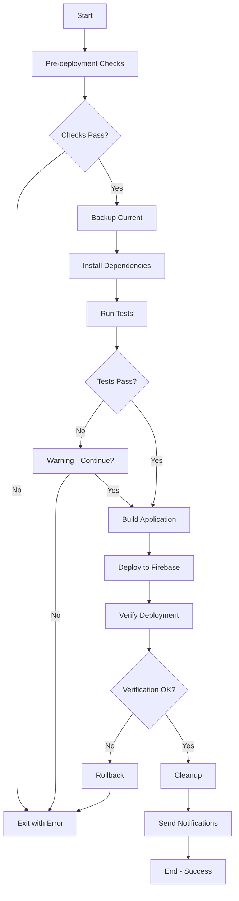

# 🚀 AUTOMATED DEPLOYMENT GUIDE
## Souk El-Syarat - Zero-Touch Deployment System

**Version:** 2.0.0  
**Status:** READY FOR USE  
**Last Updated:** August 25, 2025

---

## 📋 **TABLE OF CONTENTS**

1. [Quick Start](#quick-start)
2. [Deployment Methods](#deployment-methods)
3. [Automated Scripts](#automated-scripts)
4. [GitHub Actions](#github-actions)
5. [Configuration](#configuration)
6. [Troubleshooting](#troubleshooting)
7. [Best Practices](#best-practices)

---

## 🚀 **QUICK START**

### **One-Command Deployment**

```bash
# Deploy to production with one command
npm run deploy

# Or use the quick deploy script
npm run deploy:quick
```

That's it! Your application will be built and deployed automatically.

---

## 📦 **DEPLOYMENT METHODS**

### **Method 1: NPM Scripts (Easiest)**

```bash
# Production deployment
npm run deploy

# Staging deployment
npm run deploy:staging

# Development deployment
npm run deploy:dev

# Quick deployment (no checks)
npm run deploy:quick
```

### **Method 2: Direct Script Execution**

```bash
# Full automated deployment with all checks
./deploy-automated.sh production

# Quick deployment without checks
./deploy-now.sh
```

### **Method 3: GitHub Actions (Automatic)**

Simply push to the appropriate branch:

```bash
# Deploy to production
git push origin main

# Deploy to staging
git push origin develop

# Manual trigger via GitHub UI
# Go to Actions → Auto-Deploy → Run workflow
```

---

## 🤖 **AUTOMATED SCRIPTS**

### **1. deploy-automated.sh**

**Full-featured deployment with:**
- ✅ Pre-deployment checks
- ✅ Automatic backups
- ✅ Dependency installation
- ✅ Testing suite
- ✅ Build optimization
- ✅ Firebase deployment
- ✅ Post-deployment verification
- ✅ Rollback on failure
- ✅ Notifications

**Usage:**
```bash
./deploy-automated.sh [environment] [options]

# Examples
./deploy-automated.sh production
./deploy-automated.sh staging --skip-tests
./deploy-automated.sh development --project custom-project
```

**Options:**
- `--env <environment>` - Deployment environment
- `--project <project>` - Firebase project ID
- `--skip-tests` - Skip test execution
- `--help` - Show help message

### **2. deploy-now.sh**

**Quick deployment for urgent updates:**
- Minimal checks
- Fast execution
- Direct Firebase deployment

**Usage:**
```bash
./deploy-now.sh
```

---

## 🔄 **GITHUB ACTIONS**

### **Automatic Triggers**

| Event | Branch | Environment | Automatic |
|-------|--------|-------------|-----------|
| Push | `main` | Production | ✅ |
| Push | `develop` | Staging | ✅ |
| PR Merge | `main` | Staging | ✅ |
| Manual | Any | Selected | ✅ |

### **Workflow Features**

1. **Pre-deployment Checks**
   - Environment detection
   - Branch validation
   - Permission checks

2. **Build & Test**
   - Dependency installation
   - Linting & type checking
   - Unit tests
   - Build optimization

3. **Security Scanning**
   - Dependency audit
   - Vulnerability scanning
   - License compliance

4. **Deployment**
   - Firebase hosting
   - Artifact management
   - Version tracking

5. **Verification**
   - Site availability
   - Performance testing
   - Health checks

6. **Notifications**
   - GitHub deployments
   - Slack/Discord alerts
   - Email notifications

### **Manual Trigger**

1. Go to [GitHub Actions](https://github.com/AmrNabih-hub/Souk-El-Syarat/actions)
2. Select "🚀 Automated Deployment Pipeline"
3. Click "Run workflow"
4. Select environment
5. Click "Run workflow" button

---

## ⚙️ **CONFIGURATION**

### **deploy.config.json**

Central configuration for all deployments:

```json
{
  "environments": {
    "production": {
      "firebaseProject": "souk-el-syarat",
      "url": "https://souk-el-syarat.firebaseapp.com",
      "requiresApproval": true,
      "rollback": {
        "automatic": true
      }
    }
  }
}
```

### **Environment Variables**

Set these in GitHub Secrets or local `.env`:

| Variable | Description | Required |
|----------|-------------|----------|
| `FIREBASE_SERVICE_ACCOUNT` | Service account JSON | ✅ |
| `FIREBASE_PROJECT_ID` | Firebase project ID | ✅ |
| `DISCORD_WEBHOOK` | Discord notifications | ❌ |
| `SLACK_WEBHOOK` | Slack notifications | ❌ |

---

## 🔍 **DEPLOYMENT PROCESS**

### **Step-by-Step Flow**



---

## 🛠️ **TROUBLESHOOTING**

### **Common Issues**

#### **1. Firebase Authentication Error**

```bash
Error: Failed to authenticate, have you run firebase login?
```

**Solution:**
```bash
firebase login
# Or use service account
export GOOGLE_APPLICATION_CREDENTIALS="path/to/service-account.json"
```

#### **2. Build Failures**

```bash
Error: Build failed - dist directory not created
```

**Solution:**
```bash
# Clear cache and rebuild
rm -rf node_modules dist
npm ci
npm run build
```

#### **3. Permission Denied**

```bash
Error: Permission denied executing script
```

**Solution:**
```bash
chmod +x deploy-automated.sh
chmod +x deploy-now.sh
```

#### **4. Network Issues**

```bash
Error: Network timeout during deployment
```

**Solution:**
```bash
# Retry with increased timeout
./deploy-automated.sh production --timeout 1200
```

### **Debug Mode**

Enable verbose logging:

```bash
# Set debug environment variable
DEBUG=true ./deploy-automated.sh production

# Or check logs
tail -f logs/deployment_*.log
```

---

## ✅ **BEST PRACTICES**

### **1. Pre-Deployment**
- ✅ Always commit changes before deployment
- ✅ Run tests locally first
- ✅ Check Firebase project status
- ✅ Verify environment variables

### **2. Deployment**
- ✅ Use staging environment first
- ✅ Monitor deployment progress
- ✅ Keep deployment logs
- ✅ Use version tags

### **3. Post-Deployment**
- ✅ Verify site functionality
- ✅ Check performance metrics
- ✅ Monitor error rates
- ✅ Test critical paths

### **4. Rollback Strategy**
- ✅ Keep backups of previous versions
- ✅ Document rollback procedures
- ✅ Test rollback process
- ✅ Have emergency contacts ready

---

## 📊 **MONITORING**

### **Deployment Metrics**

Track these KPIs:
- Deployment frequency
- Lead time for changes
- Mean time to recovery (MTTR)
- Change failure rate

### **Health Checks**

Automated checks include:
- HTTP status codes
- Response times
- JavaScript errors
- Resource loading

### **Performance Monitoring**

Lighthouse metrics tracked:
- Performance score
- Accessibility score
- Best practices score
- SEO score

---

## 🔐 **SECURITY**

### **Secure Deployment**

1. **Never commit secrets**
   - Use environment variables
   - Use GitHub Secrets
   - Use Firebase service accounts

2. **Access Control**
   - Limit deployment permissions
   - Use branch protection
   - Require code reviews

3. **Audit Trail**
   - Keep deployment logs
   - Track who deployed what
   - Monitor access logs

---

## 📝 **COMMAND REFERENCE**

### **Quick Commands**

```bash
# Deploy to production
npm run deploy

# Deploy to staging
npm run deploy:staging

# Quick deploy (no checks)
npm run deploy:quick

# Deploy with custom project
./deploy-automated.sh production --project my-project

# Skip tests for urgent fix
./deploy-automated.sh production --skip-tests

# View deployment help
./deploy-automated.sh --help

# Check deployment status
firebase hosting:releases:list

# Rollback to previous version
firebase hosting:rollback

# View deployment logs
tail -f logs/deployment_*.log
```

---

## 🎯 **DEPLOYMENT CHECKLIST**

Before deploying, ensure:

- [ ] Code is committed and pushed
- [ ] Tests are passing
- [ ] Build completes successfully
- [ ] Firebase project is configured
- [ ] Service account is set up
- [ ] Environment variables are set
- [ ] Backup strategy is in place
- [ ] Team is notified

---

## 🚨 **EMERGENCY PROCEDURES**

### **Immediate Rollback**

```bash
# Rollback to previous version
firebase hosting:rollback --project souk-el-syarat

# Or use specific version
firebase hosting:rollback --version VERSION_ID
```

### **Emergency Contacts**

- **DevOps Lead:** [Contact Info]
- **Firebase Support:** https://firebase.google.com/support
- **GitHub Status:** https://www.githubstatus.com

---

## 📚 **ADDITIONAL RESOURCES**

- [Firebase Hosting Documentation](https://firebase.google.com/docs/hosting)
- [GitHub Actions Documentation](https://docs.github.com/en/actions)
- [Service Account Setup Guide](./firebase-service-account-setup.md)
- [Deployment Configuration](./deploy.config.json)

---

## 🎉 **SUMMARY**

Your automated deployment system is now ready with:

✅ **Multiple deployment methods**
- NPM scripts
- Shell scripts
- GitHub Actions

✅ **Comprehensive automation**
- Pre-deployment checks
- Automated testing
- Build optimization
- Deployment verification
- Automatic rollback

✅ **Professional features**
- Environment management
- Backup strategy
- Notification system
- Monitoring integration

**Deploy with confidence using:**
```bash
npm run deploy
```

---

**Happy Deploying!** 🚀

*Last updated: August 25, 2025*  
*Version: 2.0.0*