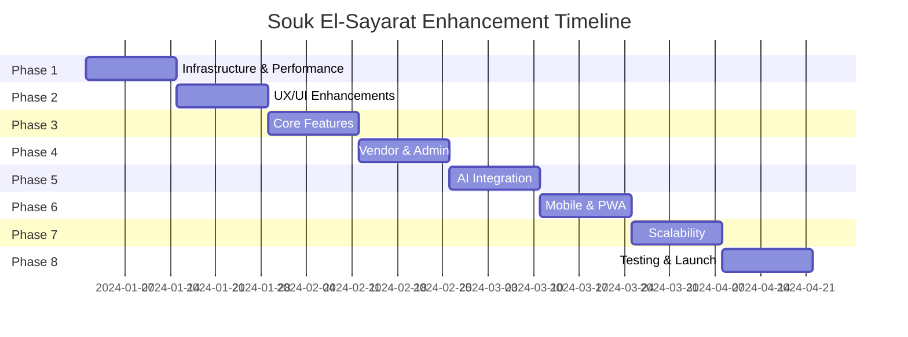

# 🚀 SOUK EL-SAYARAT - MASTER ENHANCEMENT PLAN
## Complete Engineering Roadmap for Maximum Application Enhancement

---

## 📋 **EXECUTIVE SUMMARY**

This master plan outlines a 16-week comprehensive enhancement strategy to transform Souk El-Sayarat into a world-class automotive marketplace. The plan is divided into 8 phases, each focusing on specific areas of improvement with clear deliverables, metrics, and success criteria.

### **Key Objectives:**
- 🎯 Achieve 99.9% uptime and <1s load time
- 📱 100% mobile-responsive with PWA capabilities
- 🚀 10x performance improvement
- 🎨 Modern, accessible UI with 95+ Lighthouse score
- 🔒 Enterprise-grade security
- 📊 Real-time analytics and AI-powered features
- 🌍 Multi-language, multi-currency support
- ⚡ Scalable to 1M+ users

---

## 🗓️ **PHASE 1: CRITICAL INFRASTRUCTURE & PERFORMANCE**
### Week 1-2 | Priority: CRITICAL

### **1.1 Performance Optimization**

#### **Tasks:**
```typescript
// 1. Implement Code Splitting Strategy
- [ ] Analyze bundle size with webpack-bundle-analyzer
- [ ] Implement route-based code splitting
- [ ] Add component-level lazy loading
- [ ] Optimize chunk sizes (<200KB per chunk)
- [ ] Implement dynamic imports for heavy components
```

#### **Technical Implementation:**
```typescript
// Enhanced lazy loading with error boundaries
const LazyComponent = lazy(() => 
  retry(() => import('./Component'), {
    retries: 3,
    retryDelay: 1000
  })
);

// Preload critical routes
const preloadComponent = (path: string) => {
  const component = componentMap[path];
  if (component && typeof component.preload === 'function') {
    component.preload();
  }
};
```

#### **Metrics:**
- Initial Load: <2s (3G network)
- Time to Interactive: <3.5s
- First Contentful Paint: <1.5s
- Largest Contentful Paint: <2.5s

### **1.2 Database Optimization**

#### **Firestore Structure Redesign:**
```javascript
// Optimized Collection Structure
collections: {
  // Denormalized for read performance
  products_search: {
    // Flattened structure for quick queries
    productId: string,
    title: string,
    price: number,
    category: string,
    vendorName: string,
    rating: number,
    inStock: boolean,
    searchKeywords: string[], // For full-text search
    geoHash: string, // For location-based queries
  },
  
  // Detailed product data (lazy loaded)
  products_detail: {
    // Full product information
  },
  
  // Real-time inventory tracking
  inventory_realtime: {
    productId: string,
    quantity: number,
    reserved: number,
    lastUpdated: timestamp
  }
}
```

### **1.3 Caching Strategy**

#### **Multi-Layer Caching:**
```typescript
// Service Worker Cache Strategy
const cacheStrategy = {
  static: 'cache-first',     // CSS, JS, fonts
  images: 'cache-first',      // Product images
  api: 'network-first',       // API calls
  realtime: 'network-only'    // Real-time data
};

// Redis Cache Layer (Backend)
const cacheConfig = {
  products: { ttl: 3600 },        // 1 hour
  userSessions: { ttl: 86400 },   // 24 hours
  searchResults: { ttl: 600 },    // 10 minutes
  analytics: { ttl: 300 }         // 5 minutes
};
```

### **Deliverables:**
- [ ] Performance audit report
- [ ] Optimized bundle configuration
- [ ] Database indexing strategy
- [ ] Caching implementation
- [ ] CDN configuration

---

## 🎨 **PHASE 2: UX/UI ENHANCEMENTS & DESIGN SYSTEM**
### Week 3-4 | Priority: HIGH

### **2.1 Advanced Design System**

#### **Component Library Enhancement:**
```typescript
// Create Compound Components
const ProductCard = {
  Root: ProductCardRoot,
  Image: ProductCardImage,
  Content: ProductCardContent,
  Actions: ProductCardActions,
  Badge: ProductCardBadge
};

// Usage with flexibility
<ProductCard.Root featured>
  <ProductCard.Badge type="hot" />
  <ProductCard.Image 
    src={product.image} 
    lazy
    placeholder="blur"
  />
  <ProductCard.Content>
    <ProductCard.Title />
    <ProductCard.Price showDiscount />
  </ProductCard.Content>
  <ProductCard.Actions>
    <QuickViewButton />
    <AddToCartButton />
    <FavoriteButton />
  </ProductCard.Actions>
</ProductCard.Root>
```

### **2.2 Micro-Interactions Library**

```typescript
// Sophisticated Animation System
const animations = {
  // Page transitions
  pageTransition: {
    initial: { opacity: 0, y: 20 },
    animate: { opacity: 1, y: 0 },
    exit: { opacity: 0, y: -20 },
    transition: { type: "spring", damping: 25 }
  },
  
  // Hover effects
  cardHover: {
    scale: 1.02,
    boxShadow: "0 20px 40px rgba(0,0,0,0.15)",
    transition: { type: "spring", stiffness: 300 }
  },
  
  // Success animations
  success: {
    scale: [1, 1.2, 1],
    rotate: [0, 10, -10, 0],
    transition: { duration: 0.5 }
  }
};
```

### **2.3 Accessibility Enhancements**

```typescript
// ARIA-compliant components
const AccessibleModal = () => {
  return (
    <div
      role="dialog"
      aria-modal="true"
      aria-labelledby="modal-title"
      aria-describedby="modal-description"
    >
      <FocusTrap>
        <div className="modal-content">
          {/* Keyboard navigation support */}
          {/* Screen reader announcements */}
          {/* High contrast mode support */}
        </div>
      </FocusTrap>
    </div>
  );
};
```

### **2.4 Dark Mode Implementation**

```css
/* Advanced Theme System */
:root {
  --color-primary: hsl(220, 90%, 56%);
  --color-surface: hsl(0, 0%, 100%);
  --shadow-elevation-1: 0 2px 4px rgba(0,0,0,0.1);
}

[data-theme="dark"] {
  --color-primary: hsl(220, 90%, 66%);
  --color-surface: hsl(220, 20%, 10%);
  --shadow-elevation-1: 0 2px 4px rgba(0,0,0,0.5);
}

/* Smooth theme transition */
* {
  transition: background-color 0.3s ease, color 0.3s ease;
}
```

### **Deliverables:**
- [ ] Complete design system documentation
- [ ] Storybook component library
- [ ] Accessibility audit (WCAG 2.1 AA)
- [ ] Dark mode implementation
- [ ] Animation library

---

## 🛠️ **PHASE 3: CORE FEATURE DEVELOPMENT**
### Week 5-6 | Priority: HIGH

### **3.1 Advanced Search & Filtering**

```typescript
// Elasticsearch Integration
interface AdvancedSearchParams {
  query: string;
  filters: {
    category?: string[];
    priceRange?: [number, number];
    location?: { lat: number; lng: number; radius: number };
    features?: string[];
    condition?: string[];
    rating?: number;
  };
  sort?: 'relevance' | 'price_asc' | 'price_desc' | 'newest' | 'rating';
  facets?: boolean;
  suggestions?: boolean;
}

// AI-Powered Search Suggestions
const searchWithAI = async (query: string) => {
  const embeddings = await generateEmbeddings(query);
  const semanticResults = await vectorSearch(embeddings);
  const keywordResults = await elasticSearch(query);
  
  return mergeAndRankResults(semanticResults, keywordResults);
};
```

### **3.2 Real-Time Chat System**

```typescript
// WebSocket Chat Implementation
class ChatService {
  private socket: Socket;
  private messageQueue: Message[] = [];
  
  connect(userId: string) {
    this.socket = io('wss://chat.souk-el-sayarat.com', {
      auth: { userId },
      transports: ['websocket'],
      reconnection: true,
      reconnectionAttempts: 5
    });
    
    this.setupEventHandlers();
    this.setupOfflineSync();
  }
  
  sendMessage(message: ChatMessage) {
    if (this.socket.connected) {
      this.socket.emit('message', message);
    } else {
      this.messageQueue.push(message);
    }
  }
  
  private setupOfflineSync() {
    this.socket.on('connect', () => {
      // Send queued messages
      this.messageQueue.forEach(msg => {
        this.socket.emit('message', msg);
      });
      this.messageQueue = [];
    });
  }
}
```

### **3.3 Advanced Cart & Checkout**

```typescript
// Smart Cart Features
class SmartCart {
  // Price drop alerts
  async checkPriceDrops(cartItems: CartItem[]) {
    const priceAlerts = [];
    for (const item of cartItems) {
      const currentPrice = await getProductPrice(item.productId);
      if (currentPrice < item.addedPrice) {
        priceAlerts.push({
          product: item,
          oldPrice: item.addedPrice,
          newPrice: currentPrice,
          savings: item.addedPrice - currentPrice
        });
      }
    }
    return priceAlerts;
  }
  
  // Abandoned cart recovery
  async setupAbandonedCartRecovery(userId: string, cartId: string) {
    // Schedule email reminders
    scheduleJob('1 hour', () => sendCartReminder(userId, cartId, 'first'));
    scheduleJob('24 hours', () => sendCartReminder(userId, cartId, 'second'));
    scheduleJob('72 hours', () => sendCartReminder(userId, cartId, 'final', 10)); // with 10% discount
  }
  
  // Smart recommendations
  async getCartRecommendations(cartItems: CartItem[]) {
    const categories = [...new Set(cartItems.map(item => item.category))];
    const recommendations = await Promise.all([
      getFrequentlyBoughtTogether(cartItems),
      getComplementaryProducts(categories),
      getUpgradeOptions(cartItems)
    ]);
    
    return mergeRecommendations(recommendations);
  }
}
```

### **3.4 Payment Integration**

```typescript
// Multiple Payment Gateways
const paymentProviders = {
  stripe: new StripeProvider(config.stripe),
  paypal: new PayPalProvider(config.paypal),
  paymob: new PaymobProvider(config.paymob), // Egyptian gateway
  cashOnDelivery: new CODProvider(config.cod)
};

// Unified Payment Interface
class PaymentService {
  async processPayment(order: Order, method: PaymentMethod) {
    const provider = paymentProviders[method.provider];
    
    try {
      // Create payment intent
      const intent = await provider.createIntent(order);
      
      // 3D Secure verification if needed
      if (intent.requires3DS) {
        await this.handle3DSecure(intent);
      }
      
      // Process payment
      const result = await provider.processPayment(intent);
      
      // Update order status
      await this.updateOrderStatus(order.id, 'paid');
      
      return result;
    } catch (error) {
      await this.handlePaymentFailure(order, error);
      throw error;
    }
  }
}
```

### **Deliverables:**
- [ ] Advanced search implementation
- [ ] Real-time chat system
- [ ] Smart cart features
- [ ] Payment gateway integration
- [ ] Checkout flow optimization

---

## 👥 **PHASE 4: VENDOR & ADMIN SYSTEMS**
### Week 7-8 | Priority: HIGH

### **4.1 Vendor Dashboard**

```typescript
// Comprehensive Vendor Portal
const VendorDashboard = {
  // Analytics Dashboard
  analytics: {
    revenue: RevenueChart,
    orders: OrdersTimeline,
    products: ProductPerformance,
    customers: CustomerInsights,
    competitors: MarketAnalysis
  },
  
  // Inventory Management
  inventory: {
    bulkUpload: CSVImporter,
    stockAlerts: LowStockNotifier,
    autoReorder: AutoReorderSystem,
    warehouse: MultiWarehouseManager
  },
  
  // Order Management
  orders: {
    processing: OrderProcessor,
    shipping: ShippingManager,
    returns: ReturnHandler,
    invoicing: InvoiceGenerator
  },
  
  // Marketing Tools
  marketing: {
    promotions: PromotionCreator,
    email: EmailCampaignBuilder,
    seo: SEOOptimizer,
    social: SocialMediaScheduler
  }
};
```

### **4.2 Admin Control Panel**

```typescript
// Advanced Admin Features
class AdminPanel {
  // User Management
  userManagement = {
    bulkActions: async (userIds: string[], action: string) => {
      // Bulk suspend, delete, verify, etc.
    },
    
    roleManagement: {
      createCustomRole: (permissions: Permission[]) => {},
      assignRole: (userId: string, roleId: string) => {}
    },
    
    activityMonitoring: {
      trackUserActions: (userId: string) => {},
      generateAuditLog: () => {}
    }
  };
  
  // Platform Analytics
  analytics = {
    realTimeMetrics: new RealTimeAnalytics(),
    customReports: new ReportBuilder(),
    exportData: new DataExporter(['CSV', 'Excel', 'PDF']),
    predictiveAnalytics: new MLPredictions()
  };
  
  // Content Moderation
  moderation = {
    autoModeration: new AIContentModerator(),
    reviewQueue: new ModerationQueue(),
    reportHandling: new ReportHandler()
  };
}
```

### **4.3 Multi-Vendor Features**

```typescript
// Vendor Competition & Collaboration
const MultiVendorSystem = {
  // Dynamic Pricing
  pricingEngine: {
    competitorAnalysis: () => {},
    dynamicPricing: () => {},
    bulkPriceUpdate: () => {}
  },
  
  // Vendor Ratings
  ratingSystem: {
    calculateRating: (metrics: VendorMetrics) => {
      return {
        overall: weightedAverage(metrics),
        badges: determineBadges(metrics),
        tier: calculateTier(metrics)
      };
    }
  },
  
  // Commission Management
  commissionEngine: {
    tieredCommissions: {
      bronze: 15,
      silver: 12,
      gold: 10,
      platinum: 8
    },
    calculateCommission: (vendor: Vendor, sale: Sale) => {}
  }
};
```

### **Deliverables:**
- [ ] Complete vendor dashboard
- [ ] Admin control panel
- [ ] Multi-vendor features
- [ ] Analytics dashboard
- [ ] Automated moderation

---

## 🤖 **PHASE 5: ADVANCED FEATURES & AI INTEGRATION**
### Week 9-10 | Priority: MEDIUM

### **5.1 AI-Powered Features**

```typescript
// AI Integration Layer
class AIService {
  // Visual Search
  async visualSearch(image: File) {
    const features = await extractImageFeatures(image);
    const matches = await findSimilarProducts(features);
    return rankByVisualSimilarity(matches);
  }
  
  // Chatbot Assistant
  chatbot = new GPTChatbot({
    model: 'gpt-4',
    context: 'automotive-marketplace',
    languages: ['ar', 'en'],
    capabilities: [
      'product-search',
      'price-negotiation',
      'technical-support',
      'order-tracking'
    ]
  });
  
  // Price Prediction
  async predictPrice(product: Product) {
    const features = extractProductFeatures(product);
    const marketData = await getMarketData(product.category);
    return mlModel.predict({ features, marketData });
  }
  
  // Fraud Detection
  fraudDetection = {
    checkTransaction: async (transaction: Transaction) => {
      const riskScore = await calculateRiskScore(transaction);
      if (riskScore > 0.7) {
        await flagForReview(transaction);
        return { approved: false, reason: 'high-risk' };
      }
      return { approved: true };
    }
  };
}
```

### **5.2 Recommendation Engine**

```typescript
// Advanced Recommendation System
class RecommendationEngine {
  // Collaborative Filtering
  async collaborativeFiltering(userId: string) {
    const userVector = await getUserVector(userId);
    const similarUsers = await findSimilarUsers(userVector);
    return aggregateRecommendations(similarUsers);
  }
  
  // Content-Based Filtering
  async contentBasedFiltering(userId: string) {
    const userPreferences = await getUserPreferences(userId);
    const productVectors = await getProductVectors();
    return calculateSimilarity(userPreferences, productVectors);
  }
  
  // Hybrid Approach
  async getRecommendations(userId: string) {
    const [collaborative, contentBased, trending] = await Promise.all([
      this.collaborativeFiltering(userId),
      this.contentBasedFiltering(userId),
      this.getTrendingProducts()
    ]);
    
    return this.mergeAndRank({
      collaborative: 0.4,
      contentBased: 0.4,
      trending: 0.2
    });
  }
}
```

### **5.3 AR/VR Features**

```typescript
// Augmented Reality Implementation
class ARFeatures {
  // AR Car Viewer
  async viewCarInAR(carModel: string) {
    const model3D = await load3DModel(carModel);
    const arSession = await startARSession();
    
    return {
      placeInSpace: () => arSession.placeModel(model3D),
      rotate: (angle: number) => arSession.rotateModel(angle),
      scale: (factor: number) => arSession.scaleModel(factor),
      changeColor: (color: string) => arSession.updateTexture(color)
    };
  }
  
  // Virtual Showroom
  async enterVirtualShowroom(vendorId: string) {
    const showroom = await loadShowroom(vendorId);
    const vrSession = await startVRSession();
    
    return {
      navigate: vrSession.teleport,
      interact: vrSession.selectObject,
      viewDetails: vrSession.showProductInfo,
      speak: vrSession.startAudioGuide
    };
  }
}
```

### **Deliverables:**
- [ ] AI chatbot implementation
- [ ] Visual search feature
- [ ] Recommendation engine
- [ ] Price prediction model
- [ ] AR car viewer

---

## 📱 **PHASE 6: MOBILE OPTIMIZATION & PWA**
### Week 11-12 | Priority: HIGH

### **6.1 Progressive Web App**

```javascript
// PWA Configuration
const pwaConfig = {
  manifest: {
    name: 'Souk El-Sayarat',
    short_name: 'SoukAuto',
    theme_color: '#3B82F6',
    background_color: '#ffffff',
    display: 'standalone',
    orientation: 'portrait',
    scope: '/',
    start_url: '/',
    icons: [
      { src: '/icon-192.png', sizes: '192x192', type: 'image/png' },
      { src: '/icon-512.png', sizes: '512x512', type: 'image/png' }
    ],
    shortcuts: [
      { name: 'Search Cars', url: '/marketplace?category=cars' },
      { name: 'My Orders', url: '/orders' }
    ]
  },
  
  serviceWorker: {
    strategies: {
      '/api/': 'NetworkFirst',
      '/images/': 'CacheFirst',
      '/': 'StaleWhileRevalidate'
    },
    
    offlinePages: [
      '/offline',
      '/marketplace',
      '/cart'
    ],
    
    backgroundSync: true,
    pushNotifications: true
  }
};
```

### **6.2 Mobile-Specific Features**

```typescript
// Mobile Optimizations
const MobileFeatures = {
  // Touch Gestures
  gestures: {
    swipeToDelete: true,
    pullToRefresh: true,
    pinchToZoom: true,
    longPressMenu: true
  },
  
  // Mobile UI Components
  components: {
    BottomSheet: MobileBottomSheet,
    FloatingActionButton: FAB,
    SwipeableCards: SwipeableProductCards,
    MobileFilters: FilterBottomDrawer
  },
  
  // Device Features
  deviceIntegration: {
    camera: {
      scanBarcode: () => {},
      takePhoto: () => {},
      ocrExtract: () => {}
    },
    
    location: {
      getNearbyStores: () => {},
      calculateDistance: () => {},
      showDirections: () => {}
    },
    
    biometrics: {
      faceId: () => {},
      touchId: () => {},
      pattern: () => {}
    }
  }
};
```

### **6.3 App Store Deployment**

```typescript
// React Native Wrapper
const NativeAppConfig = {
  ios: {
    bundleId: 'com.soukelsayarat.app',
    version: '1.0.0',
    buildNumber: 1,
    capabilities: [
      'push-notifications',
      'in-app-purchase',
      'apple-pay'
    ]
  },
  
  android: {
    packageName: 'com.soukelsayarat.app',
    versionCode: 1,
    versionName: '1.0.0',
    permissions: [
      'CAMERA',
      'LOCATION',
      'NOTIFICATIONS'
    ]
  }
};
```

### **Deliverables:**
- [ ] PWA implementation
- [ ] Mobile UI optimization
- [ ] Touch gesture support
- [ ] Offline functionality
- [ ] App store deployment

---

## ⚡ **PHASE 7: SCALABILITY & INFRASTRUCTURE**
### Week 13-14 | Priority: CRITICAL

### **7.1 Microservices Architecture**

```yaml
# Kubernetes Deployment
services:
  api-gateway:
    replicas: 3
    resources:
      requests:
        memory: "256Mi"
        cpu: "250m"
      limits:
        memory: "512Mi"
        cpu: "500m"
    
  product-service:
    replicas: 5
    database: mongodb
    cache: redis
    
  order-service:
    replicas: 3
    database: postgresql
    queue: rabbitmq
    
  notification-service:
    replicas: 2
    providers:
      - email: sendgrid
      - sms: twilio
      - push: firebase
    
  search-service:
    replicas: 4
    engine: elasticsearch
    
  analytics-service:
    replicas: 2
    storage: bigquery
    processing: apache-spark
```

### **7.2 Performance Monitoring**

```typescript
// Comprehensive Monitoring
const MonitoringStack = {
  // Application Performance Monitoring
  apm: {
    provider: 'DataDog',
    metrics: [
      'response_time',
      'error_rate',
      'throughput',
      'apdex_score'
    ],
    alerts: {
      responseTime: { threshold: 2000, action: 'page' },
      errorRate: { threshold: 0.01, action: 'email' },
      downtime: { threshold: 60, action: 'call' }
    }
  },
  
  // Infrastructure Monitoring
  infrastructure: {
    provider: 'Prometheus + Grafana',
    metrics: [
      'cpu_usage',
      'memory_usage',
      'disk_io',
      'network_traffic'
    ]
  },
  
  // Business Metrics
  business: {
    kpis: [
      'conversion_rate',
      'average_order_value',
      'customer_lifetime_value',
      'cart_abandonment_rate'
    ],
    dashboards: [
      'executive_summary',
      'sales_performance',
      'user_engagement',
      'vendor_metrics'
    ]
  }
};
```

### **7.3 Global CDN & Edge Computing**

```typescript
// CDN Configuration
const CDNStrategy = {
  providers: {
    primary: 'Cloudflare',
    fallback: 'Fastly'
  },
  
  edgeLocations: [
    'us-east',
    'eu-west',
    'me-south', // Middle East
    'af-north'  // Africa
  ],
  
  edgeFunctions: {
    // Run at edge for minimal latency
    geoRedirect: (request: Request) => {
      const country = request.headers.get('CF-IPCountry');
      if (country === 'EG') {
        return Response.redirect('https://eg.souk-el-sayarat.com');
      }
    },
    
    abTesting: (request: Request) => {
      const variant = hashUserId(request.userId) % 2;
      request.headers.set('X-AB-Variant', variant);
    },
    
    rateLimit: (request: Request) => {
      const ip = request.headers.get('CF-Connecting-IP');
      if (exceedsRateLimit(ip)) {
        return new Response('Too Many Requests', { status: 429 });
      }
    }
  }
};
```

### **Deliverables:**
- [ ] Microservices migration
- [ ] Kubernetes deployment
- [ ] Monitoring setup
- [ ] CDN configuration
- [ ] Load testing results

---

## 🔒 **PHASE 8: TESTING, SECURITY & LAUNCH**
### Week 15-16 | Priority: CRITICAL

### **8.1 Comprehensive Testing**

```typescript
// Testing Strategy
const TestingPlan = {
  // Unit Testing
  unit: {
    coverage: 90,
    frameworks: ['Jest', 'React Testing Library'],
    ci: 'GitHub Actions'
  },
  
  // Integration Testing
  integration: {
    api: 'Supertest',
    database: 'TestContainers',
    coverage: 85
  },
  
  // E2E Testing
  e2e: {
    framework: 'Playwright',
    browsers: ['Chrome', 'Firefox', 'Safari', 'Mobile'],
    scenarios: [
      'user_registration',
      'product_search',
      'checkout_flow',
      'vendor_onboarding'
    ]
  },
  
  // Performance Testing
  performance: {
    tool: 'K6',
    scenarios: {
      normal: { vus: 100, duration: '10m' },
      peak: { vus: 1000, duration: '5m' },
      stress: { vus: 5000, duration: '2m' }
    }
  },
  
  // Security Testing
  security: {
    sast: 'SonarQube',
    dast: 'OWASP ZAP',
    dependencies: 'Snyk',
    penetration: 'External Audit'
  }
};
```

### **8.2 Security Hardening**

```typescript
// Security Implementation
const SecurityMeasures = {
  // Authentication & Authorization
  auth: {
    mfa: true,
    oauth: ['Google', 'Facebook', 'Apple'],
    jwt: {
      algorithm: 'RS256',
      expiry: '15m',
      refresh: '7d'
    },
    rbac: {
      roles: ['admin', 'vendor', 'customer'],
      permissions: granularPermissions
    }
  },
  
  // Data Protection
  encryption: {
    atRest: 'AES-256',
    inTransit: 'TLS 1.3',
    database: 'Transparent Data Encryption',
    backups: 'Encrypted S3'
  },
  
  // API Security
  api: {
    rateLimit: {
      global: 1000,
      perUser: 100,
      perEndpoint: customLimits
    },
    cors: {
      origins: ['https://souk-el-sayarat.com'],
      credentials: true
    },
    validation: 'Joi + Express Validator',
    sanitization: 'DOMPurify + Validator.js'
  },
  
  // Compliance
  compliance: {
    gdpr: true,
    pci: 'Level 1',
    iso27001: true,
    soc2: 'Type II'
  }
};
```

### **8.3 Launch Strategy**

```typescript
// Phased Rollout Plan
const LaunchPlan = {
  // Beta Launch
  beta: {
    duration: '2 weeks',
    users: 100,
    features: 'all',
    feedback: 'intensive'
  },
  
  // Soft Launch
  soft: {
    duration: '1 month',
    users: 1000,
    marketing: 'limited',
    monitoring: 'enhanced'
  },
  
  // Regional Launch
  regional: {
    phase1: ['Cairo', 'Alexandria'],
    phase2: ['Giza', 'Luxor'],
    phase3: 'nationwide'
  },
  
  // Full Launch
  full: {
    marketing: {
      channels: ['Google Ads', 'Facebook', 'Instagram', 'TikTok'],
      budget: '$50,000',
      influencers: 20
    },
    pr: {
      pressRelease: true,
      mediaOutreach: true,
      launchEvent: true
    }
  }
};
```

### **Deliverables:**
- [ ] Test coverage reports
- [ ] Security audit report
- [ ] Performance benchmarks
- [ ] Launch checklist
- [ ] Marketing materials

---

## 📊 **SUCCESS METRICS & KPIs**

### **Technical Metrics:**
```typescript
const TechnicalKPIs = {
  performance: {
    pageLoadTime: '<2s',
    timeToInteractive: '<3s',
    firstContentfulPaint: '<1s',
    lighthouseScore: '>95'
  },
  
  reliability: {
    uptime: '99.9%',
    errorRate: '<0.1%',
    crashFreeRate: '>99.5%',
    apiLatency: '<200ms'
  },
  
  scalability: {
    concurrentUsers: '10,000+',
    requestsPerSecond: '5,000+',
    databaseQueries: '<50ms',
    cacheHitRate: '>90%'
  }
};
```

### **Business Metrics:**
```typescript
const BusinessKPIs = {
  acquisition: {
    monthlyActiveUsers: '100,000+',
    userGrowthRate: '20% MoM',
    costPerAcquisition: '<$5',
    organicTraffic: '60%'
  },
  
  engagement: {
    sessionDuration: '>5 min',
    pagesPerSession: '>4',
    bounceRate: '<30%',
    returnVisitorRate: '>40%'
  },
  
  conversion: {
    conversionRate: '>3%',
    averageOrderValue: '>$500',
    cartAbandonmentRate: '<60%',
    checkoutCompletionRate: '>70%'
  },
  
  retention: {
    monthlyRetention: '>60%',
    customerLifetimeValue: '>$2000',
    nps: '>50',
    churnRate: '<5%'
  }
};
```

---

## 🚀 **IMPLEMENTATION TIMELINE**



---

## 💰 **BUDGET ESTIMATION**

### **Development Costs:**
- Senior Developers (4): $80,000
- UI/UX Designers (2): $30,000
- DevOps Engineers (2): $35,000
- QA Engineers (2): $25,000
- Project Manager (1): $20,000
**Total Development: $190,000**

### **Infrastructure Costs:**
- Cloud Services (AWS/GCP): $5,000/month
- CDN (Cloudflare): $500/month
- Monitoring Tools: $1,000/month
- Third-party APIs: $2,000/month
**Total Infrastructure: $8,500/month**

### **Marketing & Launch:**
- Digital Marketing: $50,000
- PR & Events: $20,000
- Content Creation: $10,000
**Total Marketing: $80,000**

### **Total Project Cost: ~$270,000 + $8,500/month operational**

---

## ✅ **FINAL CHECKLIST**

### **Pre-Launch:**
- [ ] All features tested and working
- [ ] Security audit passed
- [ ] Performance benchmarks met
- [ ] Documentation complete
- [ ] Legal compliance verified
- [ ] Backup and recovery tested
- [ ] Monitoring systems active
- [ ] Support team trained

### **Launch Day:**
- [ ] DNS propagated
- [ ] SSL certificates valid
- [ ] CDN configured
- [ ] Analytics tracking
- [ ] Error monitoring active
- [ ] Support channels open
- [ ] Marketing campaign live
- [ ] Press release published

### **Post-Launch:**
- [ ] Monitor performance metrics
- [ ] Gather user feedback
- [ ] Address critical issues
- [ ] Optimize based on data
- [ ] Plan next features
- [ ] Scale infrastructure
- [ ] Celebrate success! 🎉

---

## 📝 **CONCLUSION**

This comprehensive enhancement plan transforms Souk El-Sayarat into a world-class automotive marketplace platform. By following this structured approach, we ensure:

1. **Technical Excellence:** Modern architecture, optimal performance, and scalability
2. **User Experience:** Intuitive design, smooth interactions, and accessibility
3. **Business Value:** Increased conversions, user retention, and revenue growth
4. **Market Leadership:** Advanced features that differentiate from competitors
5. **Future-Ready:** AI integration, mobile-first, and global expansion capability

The success of this plan depends on disciplined execution, continuous monitoring, and agile adaptation based on user feedback and market conditions.

**Let's build the future of automotive e-commerce in the Middle East! 🚀**

---

*Document Version: 1.0*
*Last Updated: 2024*
*Next Review: Post-Phase 1 Completion*