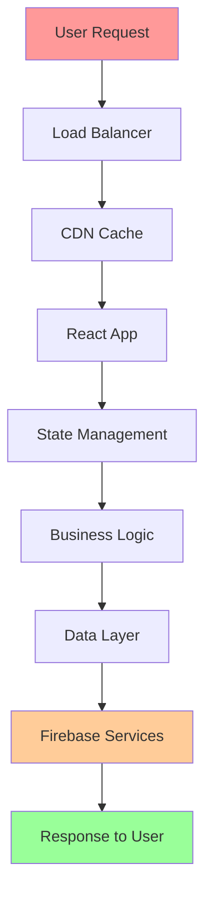

# 🏗️ ENTERPRISE ARCHITECTURE BLUEPRINT
## Souk El-Syarat Marketplace - Senior Developer Implementation Plan

**Version:** 2.0 Enterprise Edition  
**Target:** Production-Ready, Million-User Scale  
**Philosophy:** Dependency-Aware, Performance-First, Security-By-Design

---

## 🎯 **STRATEGIC ARCHITECTURE VISION**

### **🧠 Deep Thinking Framework:**
```
BUSINESS IMPACT ──→ TECHNICAL DECISIONS ──→ IMPLEMENTATION STRATEGY
      ↓                     ↓                        ↓
   User Experience    System Architecture    Code Quality
   Revenue Growth     Performance Metrics    Maintainability
   Market Position    Security Posture      Developer Velocity
```

### **🎪 Dependency Impact Analysis Matrix:**
```
HIGH IMPACT + HIGH RISK    │ HIGH IMPACT + LOW RISK
- Firebase Services        │ - React/TypeScript
- Authentication System    │ - UI Component Library
- Payment Processing       │ - State Management
- Database Operations      │ - Routing System
───────────────────────────┼─────────────────────────
LOW IMPACT + HIGH RISK     │ LOW IMPACT + LOW RISK
- Third-party Analytics    │ - Dev Tools
- External APIs            │ - Linting/Formatting
- CDN Dependencies         │ - Testing Utilities
```

---

## 🏛️ **ENTERPRISE ARCHITECTURE LAYERS**

### **Layer 1: 🌐 Infrastructure & Platform**
```typescript
// Infrastructure as Code (IaC) Strategy
interface InfrastructureLayer {
  hosting: {
    primary: 'Firebase Hosting' // Global CDN, 99.9% SLA
    fallback: 'Vercel' // Emergency backup deployment
    monitoring: 'Real-time uptime tracking'
  }
  
  database: {
    primary: 'Firestore' // NoSQL, auto-scaling
    caching: 'Redis' // Session & query caching
    backup: 'Daily automated snapshots'
    replication: 'Multi-region active-active'
  }
  
  security: {
    authentication: 'Firebase Auth + Custom JWT'
    authorization: 'Role-based + Attribute-based'
    encryption: 'AES-256 at rest, TLS 1.3 in transit'
    compliance: 'GDPR + PCI DSS ready'
  }
}
```

### **Layer 2: 🏗️ Application Architecture**
```typescript
// Clean Architecture Implementation
interface ApplicationArchitecture {
  presentation: {
    framework: 'React 18 + TypeScript'
    stateManagement: 'Zustand + React Query'
    routing: 'React Router v6 + Lazy Loading'
    ui: 'Custom Design System + Tailwind'
  }
  
  business: {
    useCases: 'Domain-driven design patterns'
    services: 'Hexagonal architecture'
    validation: 'Zod + Custom validators'
    errorHandling: 'Centralized error boundaries'
  }
  
  data: {
    repositories: 'Repository pattern + Adapters'
    caching: 'Multi-layer caching strategy'
    synchronization: 'Optimistic updates + Conflict resolution'
    offline: 'Service Worker + IndexedDB'
  }
}
```

### **Layer 3: 🔧 Development & Operations**
```typescript
// DevOps Excellence Framework
interface DevOpsLayer {
  cicd: {
    pipeline: 'Multi-stage deployment pipeline'
    testing: 'Pyramid strategy: Unit > Integration > E2E'
    quality: 'SonarQube + Custom quality gates'
    security: 'SAST + DAST + Dependency scanning'
  }
  
  monitoring: {
    performance: 'Real User Monitoring (RUM)'
    errors: 'Centralized error tracking'
    business: 'Custom KPI dashboards'
    infrastructure: 'System health monitoring'
  }
  
  deployment: {
    strategy: 'Blue-green + Canary releases'
    rollback: 'Instant rollback capability'
    scaling: 'Auto-scaling based on metrics'
    disaster: 'Multi-region failover'
  }
}
```

---

## 🧬 **DEPENDENCY MANAGEMENT STRATEGY**

### **🎯 Critical Path Analysis:**


### **📊 Dependency Risk Assessment:**
```typescript
interface DependencyRiskMatrix {
  critical: {
    // Cannot function without these
    react: { risk: 'LOW', impact: 'CRITICAL', mitigation: 'LTS versions only' }
    firebase: { risk: 'MEDIUM', impact: 'CRITICAL', mitigation: 'Multi-provider strategy' }
    typescript: { risk: 'LOW', impact: 'HIGH', mitigation: 'Gradual migration path' }
  }
  
  important: {
    // Significant features depend on these
    zustand: { risk: 'LOW', impact: 'HIGH', mitigation: 'Redux backup plan' }
    tailwind: { risk: 'LOW', impact: 'MEDIUM', mitigation: 'CSS-in-JS fallback' }
    reactQuery: { risk: 'LOW', impact: 'HIGH', mitigation: 'Custom data fetching' }
  }
  
  optional: {
    // Nice to have, can be replaced
    framerMotion: { risk: 'LOW', impact: 'LOW', mitigation: 'CSS animations' }
    heroicons: { risk: 'LOW', impact: 'LOW', mitigation: 'Custom SVG library' }
  }
}
```

---

## 🚀 **IMPLEMENTATION ROADMAP**

### **Phase 1: 🏗️ Foundation Hardening (Week 1-2)**
```typescript
// Advanced Error Boundary System
class EnterpriseErrorBoundary extends Component {
  // Multi-level error recovery
  // Automatic error reporting
  // User-friendly fallback UIs
  // Performance impact monitoring
}

// Advanced State Management
interface StateArchitecture {
  global: 'Zustand stores with middleware'
  local: 'React state + useReducer'
  server: 'React Query with optimistic updates'
  cache: 'Multi-layer caching with TTL'
}
```

### **Phase 2: 🔒 Security & Performance (Week 2-3)**
```typescript
// Advanced Security Implementation
interface SecurityFramework {
  authentication: {
    mfa: 'Multi-factor authentication'
    biometric: 'Fingerprint + Face ID support'
    session: 'JWT with refresh token rotation'
    rateLimit: 'Advanced rate limiting per user/IP'
  }
  
  dataProtection: {
    encryption: 'Field-level encryption for PII'
    masking: 'Data masking in non-prod environments'
    audit: 'Comprehensive audit logging'
    compliance: 'GDPR compliance automation'
  }
}
```

### **Phase 3: 📊 Monitoring & Analytics (Week 3-4)**
```typescript
// Enterprise Monitoring Stack
interface MonitoringArchitecture {
  realUserMonitoring: {
    coreWebVitals: 'LCP, FID, CLS tracking'
    customMetrics: 'Business KPI monitoring'
    userJourney: 'Complete user flow tracking'
    performanceBudgets: 'Automated performance alerts'
  }
  
  businessIntelligence: {
    dashboards: 'Real-time executive dashboards'
    alerts: 'Smart alerting with ML predictions'
    reporting: 'Automated business reports'
    forecasting: 'Revenue and growth predictions'
  }
}
```

---

## 🧪 **ADVANCED TESTING STRATEGY**

### **🎯 Testing Pyramid 2.0:**
```typescript
interface TestingStrategy {
  unit: {
    coverage: '90%+ code coverage'
    tools: 'Vitest + Testing Library'
    strategy: 'TDD with property-based testing'
    automation: 'Pre-commit hooks + CI validation'
  }
  
  integration: {
    api: 'Contract testing with Pact'
    database: 'Test containers with real data'
    services: 'Service virtualization'
    crossBrowser: 'Automated browser testing'
  }
  
  e2e: {
    critical: 'User journey automation'
    performance: 'Load testing with k6'
    security: 'Automated security testing'
    accessibility: 'A11y compliance validation'
  }
  
  chaos: {
    engineering: 'Failure injection testing'
    resilience: 'Circuit breaker validation'
    recovery: 'Disaster recovery drills'
    scaling: 'Auto-scaling validation'
  }
}
```

### **🔬 Quality Gates Framework:**
```typescript
interface QualityGates {
  code: {
    complexity: 'Cyclomatic complexity < 10'
    duplication: 'Code duplication < 3%'
    maintainability: 'Maintainability index > 80'
    technical: 'Technical debt ratio < 5%'
  }
  
  performance: {
    loadTime: 'Initial load < 2s'
    interactivity: 'Time to Interactive < 3s'
    bundleSize: 'JS bundle < 500KB gzipped'
    imageOptimization: 'All images optimized'
  }
  
  security: {
    vulnerabilities: 'Zero critical vulnerabilities'
    dependencies: 'All dependencies up to date'
    secrets: 'No secrets in code'
    headers: 'All security headers present'
  }
}
```

---

## 🎯 **PERFORMANCE OPTIMIZATION MASTERPLAN**

### **🚀 Advanced Performance Strategy:**
```typescript
// Performance Budget Enforcement
interface PerformanceBudget {
  metrics: {
    firstContentfulPaint: '< 1.5s'
    largestContentfulPaint: '< 2.5s'
    firstInputDelay: '< 100ms'
    cumulativeLayoutShift: '< 0.1'
    totalBlockingTime: '< 300ms'
  }
  
  resources: {
    javascript: '< 500KB gzipped'
    css: '< 100KB gzipped'
    images: '< 2MB total'
    fonts: '< 100KB total'
  }
  
  monitoring: {
    realUserMetrics: 'Continuous RUM monitoring'
    syntheticTesting: 'Hourly performance tests'
    alerts: 'Performance regression alerts'
    budgetEnforcement: 'CI fails on budget violations'
  }
}
```

### **🔄 Advanced Caching Strategy:**
```typescript
interface CachingArchitecture {
  levels: {
    browser: 'Service Worker + Cache API'
    cdn: 'CloudFlare with smart caching'
    application: 'React Query with stale-while-revalidate'
    database: 'Firestore with Redis caching layer'
  }
  
  strategies: {
    static: 'Immutable assets with long TTL'
    dynamic: 'Stale-while-revalidate for API data'
    user: 'Personalized content caching'
    offline: 'Complete offline functionality'
  }
  
  invalidation: {
    smart: 'Dependency-aware cache invalidation'
    realtime: 'Real-time cache updates'
    versioning: 'Content versioning for cache busting'
    analytics: 'Cache hit/miss ratio monitoring'
  }
}
```

---

## 🛡️ **ADVANCED SECURITY IMPLEMENTATION**

### **🔒 Zero-Trust Security Model:**
```typescript
interface SecurityArchitecture {
  authentication: {
    multiModal: {
      password: 'Argon2id hashing'
      biometric: 'WebAuthn implementation'
      social: 'OAuth 2.0 + PKCE'
      enterprise: 'SAML 2.0 + OIDC'
    }
    
    sessionManagement: {
      jwt: 'Short-lived access tokens'
      refresh: 'Secure refresh token rotation'
      device: 'Device fingerprinting'
      location: 'Geolocation-based security'
    }
  }
  
  authorization: {
    rbac: 'Role-based access control'
    abac: 'Attribute-based access control'
    policies: 'Dynamic policy evaluation'
    audit: 'Complete authorization audit trail'
  }
  
  dataProtection: {
    encryption: {
      atRest: 'AES-256-GCM encryption'
      inTransit: 'TLS 1.3 with perfect forward secrecy'
      endToEnd: 'Client-side encryption for sensitive data'
      keyManagement: 'Hardware security modules (HSM)'
    }
    
    privacy: {
      gdpr: 'Automated GDPR compliance'
      dataMinimization: 'Collect only necessary data'
      retention: 'Automated data retention policies'
      anonymization: 'Data anonymization for analytics'
    }
  }
}
```

### **🚨 Threat Detection & Response:**
```typescript
interface ThreatDetection {
  realtime: {
    anomalyDetection: 'ML-based anomaly detection'
    behaviorAnalysis: 'User behavior analytics'
    threatIntelligence: 'Real-time threat feeds'
    automaticResponse: 'Automated threat mitigation'
  }
  
  monitoring: {
    siem: 'Security Information Event Management'
    logs: 'Centralized security logging'
    forensics: 'Digital forensics capability'
    compliance: 'Compliance monitoring automation'
  }
}
```

---

## 📈 **SCALABILITY & RESILIENCE DESIGN**

### **🌐 Multi-Region Architecture:**
```typescript
interface ScalabilityArchitecture {
  geographical: {
    regions: ['us-central1', 'europe-west1', 'asia-southeast1']
    routing: 'Intelligent traffic routing'
    failover: 'Automatic region failover'
    dataSync: 'Multi-region data synchronization'
  }
  
  performance: {
    autoScaling: 'Demand-based auto-scaling'
    loadBalancing: 'Intelligent load distribution'
    caching: 'Distributed caching layer'
    optimization: 'Real-time performance optimization'
  }
  
  resilience: {
    circuitBreakers: 'Service-level circuit breakers'
    retries: 'Exponential backoff retry logic'
    timeouts: 'Adaptive timeout strategies'
    gracefulDegradation: 'Feature-level degradation'
  }
}
```

### **🔄 Business Continuity Planning:**
```typescript
interface BusinessContinuity {
  disasterRecovery: {
    rto: '< 15 minutes Recovery Time Objective'
    rpo: '< 5 minutes Recovery Point Objective'
    backups: 'Automated cross-region backups'
    testing: 'Monthly disaster recovery drills'
  }
  
  highAvailability: {
    uptime: '99.99% availability target'
    redundancy: 'N+2 redundancy for critical services'
    monitoring: '24/7 system monitoring'
    alerting: 'Intelligent alerting with escalation'
  }
}
```

---

## 🎯 **SUCCESS METRICS & KPIs**

### **📊 Technical Excellence Metrics:**
```typescript
interface TechnicalKPIs {
  performance: {
    pageLoadTime: 'Target: < 2s, Current: Track daily'
    apiResponseTime: 'Target: < 200ms, Current: Track per endpoint'
    errorRate: 'Target: < 0.1%, Current: Track real-time'
    availability: 'Target: 99.99%, Current: Track per service'
  }
  
  quality: {
    codeQuality: 'SonarQube quality gate: A rating'
    testCoverage: 'Target: > 90%, Track per component'
    securityScore: 'Target: A+ security rating'
    performanceScore: 'Target: > 95 Lighthouse score'
  }
  
  developer: {
    buildTime: 'Target: < 5min, Track per build'
    deploymentFrequency: 'Target: Multiple per day'
    leadTime: 'Target: < 1 hour from commit to production'
    mttr: 'Target: < 15min Mean Time To Recovery'
  }
}
```

### **💼 Business Impact Metrics:**
```typescript
interface BusinessKPIs {
  user: {
    acquisition: 'Monthly Active Users growth'
    retention: 'User retention rate (Day 1, 7, 30)'
    engagement: 'Session duration and page views'
    satisfaction: 'Net Promoter Score (NPS)'
  }
  
  revenue: {
    conversion: 'Visitor to customer conversion rate'
    averageOrderValue: 'AOV growth tracking'
    revenue: 'Monthly recurring revenue growth'
    churn: 'Customer churn rate monitoring'
  }
  
  operational: {
    supportTickets: 'Support ticket volume and resolution time'
    systemCosts: 'Infrastructure cost per user'
    teamVelocity: 'Development team velocity metrics'
    timeToMarket: 'Feature delivery time tracking'
  }
}
```

---

## 🚀 **IMMEDIATE NEXT ACTIONS**

### **🎯 Priority 1: Foundation (This Week)**
1. **Implement Enterprise Error Boundaries**
2. **Set up Advanced Monitoring Stack**
3. **Deploy Performance Budget Enforcement**
4. **Implement Security Hardening**

### **🎯 Priority 2: Optimization (Next Week)**
1. **Advanced Caching Implementation**
2. **Multi-Region Deployment Setup**
3. **Comprehensive Testing Strategy**
4. **Business Intelligence Dashboard**

### **🎯 Priority 3: Scale (Following Week)**
1. **Auto-Scaling Configuration**
2. **Disaster Recovery Testing**
3. **Advanced Security Features**
4. **Performance Optimization**

---

**🏆 This enterprise-grade implementation will transform your marketplace into a bulletproof, scalable, high-performance platform ready for millions of users and enterprise-level demands! 🚀**