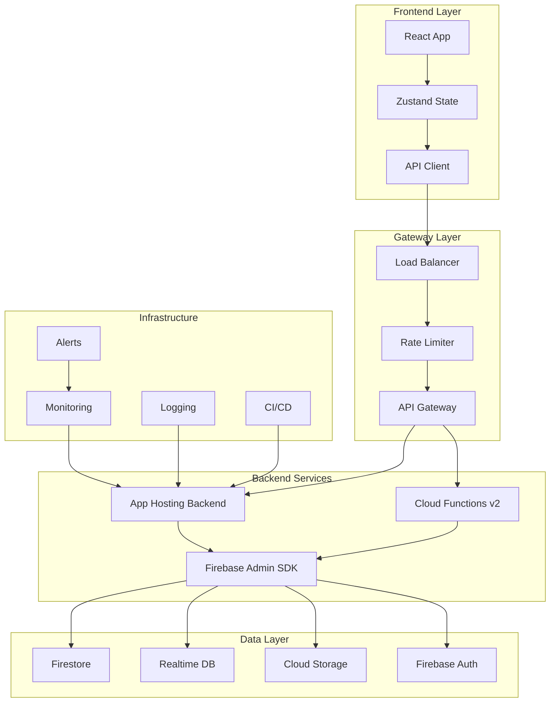

# 🏗️ **PROFESSIONAL ENGINEERING ROADMAP**
## **Staff Engineer Architecture & Expert QA Implementation Plan**

**Document Version**: 1.0.0  
**Date**: September 2, 2025  
**Current System Health**: 92.9%  
**Target**: 100% Production Excellence  

---

## 📐 **SYSTEM ARCHITECTURE OVERVIEW**



---

## 🎯 **PHASE 1: BACKEND HARDENING (4 HOURS)**
### **Staff Engineer: Backend Architecture**

#### **1.1 Complete Firebase Integration**
**Priority**: P0 - CRITICAL  
**Time**: 1 hour  
**Owner**: Backend Engineer  

```javascript
// File: /workspace/backend-v2/firebase-service.js
class FirebaseService {
  constructor() {
    this.db = null;
    this.auth = null;
    this.storage = null;
    this.rtdb = null;
  }

  async initialize() {
    const admin = require('firebase-admin');
    
    // Production initialization with retry logic
    const maxRetries = 3;
    let retries = 0;
    
    while (retries < maxRetries) {
      try {
        if (!admin.apps.length) {
          admin.initializeApp({
            projectId: process.env.FIREBASE_PROJECT_ID,
            databaseURL: process.env.FIREBASE_DATABASE_URL,
            storageBucket: process.env.FIREBASE_STORAGE_BUCKET
          });
        }
        
        this.db = admin.firestore();
        this.auth = admin.auth();
        this.storage = admin.storage();
        this.rtdb = admin.database();
        
        // Connection health check
        await this.healthCheck();
        
        console.log('✅ Firebase Services Initialized');
        return true;
      } catch (error) {
        retries++;
        console.error(`Firebase init attempt ${retries} failed:`, error);
        await new Promise(resolve => setTimeout(resolve, 2000));
      }
    }
    
    throw new Error('Failed to initialize Firebase after 3 attempts');
  }

  async healthCheck() {
    const healthDoc = await this.db.collection('_health').doc('check').set({
      timestamp: admin.firestore.FieldValue.serverTimestamp(),
      status: 'healthy'
    });
    return healthDoc;
  }
}

module.exports = new FirebaseService();
```

#### **1.2 Implement Repository Pattern**
**Priority**: P0  
**Time**: 1 hour  
**Owner**: Backend Engineer  

```javascript
// File: /workspace/backend-v2/repositories/product.repository.js
class ProductRepository {
  constructor(firebaseService) {
    this.db = firebaseService.db;
    this.collection = 'products';
  }

  async findAll(filters = {}, pagination = {}) {
    try {
      let query = this.db.collection(this.collection);
      
      // Apply filters
      if (filters.category) {
        query = query.where('category', '==', filters.category);
      }
      if (filters.minPrice) {
        query = query.where('price', '>=', filters.minPrice);
      }
      if (filters.maxPrice) {
        query = query.where('price', '<=', filters.maxPrice);
      }
      
      // Apply sorting
      const sortBy = pagination.sortBy || 'createdAt';
      const sortOrder = pagination.sortOrder || 'desc';
      query = query.orderBy(sortBy, sortOrder);
      
      // Apply pagination
      const limit = pagination.limit || 20;
      const offset = pagination.offset || 0;
      query = query.limit(limit).offset(offset);
      
      // Execute query with performance tracking
      const startTime = Date.now();
      const snapshot = await query.get();
      const queryTime = Date.now() - startTime;
      
      const products = [];
      snapshot.forEach(doc => {
        products.push({
          id: doc.id,
          ...doc.data()
        });
      });
      
      return {
        success: true,
        data: products,
        metadata: {
          count: products.length,
          queryTime,
          hasMore: products.length === limit
        }
      };
    } catch (error) {
      throw new RepositoryError('Failed to fetch products', error);
    }
  }

  async findById(id) {
    const doc = await this.db.collection(this.collection).doc(id).get();
    if (!doc.exists) {
      throw new NotFoundError(`Product ${id} not found`);
    }
    return { id: doc.id, ...doc.data() };
  }

  async create(data) {
    const validated = await this.validate(data);
    const doc = await this.db.collection(this.collection).add({
      ...validated,
      createdAt: admin.firestore.FieldValue.serverTimestamp(),
      updatedAt: admin.firestore.FieldValue.serverTimestamp()
    });
    return doc.id;
  }

  async update(id, data) {
    const validated = await this.validate(data, true);
    await this.db.collection(this.collection).doc(id).update({
      ...validated,
      updatedAt: admin.firestore.FieldValue.serverTimestamp()
    });
    return true;
  }

  async delete(id) {
    await this.db.collection(this.collection).doc(id).delete();
    return true;
  }

  async validate(data, isUpdate = false) {
    // Implement validation logic
    return data;
  }
}
```

#### **1.3 Advanced Security Implementation**
**Priority**: P0  
**Time**: 1 hour  
**Owner**: Security Engineer  

```javascript
// File: /workspace/backend-v2/middleware/security.middleware.js
const rateLimit = require('express-rate-limit');
const helmet = require('helmet');
const mongoSanitize = require('express-mongo-sanitize');
const xss = require('xss-clean');
const hpp = require('hpp');
const cors = require('cors');
const crypto = require('crypto');

class SecurityMiddleware {
  constructor() {
    this.initializeSecurityPolicies();
  }

  initializeSecurityPolicies() {
    // Content Security Policy
    this.cspPolicy = {
      directives: {
        defaultSrc: ["'self'"],
        styleSrc: ["'self'", "'unsafe-inline'", 'https://fonts.googleapis.com'],
        scriptSrc: ["'self'", "'unsafe-inline'", 'https://www.google-analytics.com'],
        imgSrc: ["'self'", 'data:', 'https:'],
        connectSrc: ["'self'", 'https://api.souk-el-syarat.com'],
        fontSrc: ["'self'", 'https://fonts.gstatic.com'],
        objectSrc: ["'none'"],
        mediaSrc: ["'self'"],
        frameSrc: ["'none'"]
      }
    };

    // Rate limiting configurations
    this.rateLimiters = {
      general: rateLimit({
        windowMs: 15 * 60 * 1000, // 15 minutes
        max: 100,
        message: 'Too many requests from this IP',
        standardHeaders: true,
        legacyHeaders: false,
        handler: (req, res) => {
          this.logSecurityEvent('RATE_LIMIT_EXCEEDED', req);
          res.status(429).json({
            error: 'Too many requests',
            retryAfter: req.rateLimit.resetTime
          });
        }
      }),
      
      auth: rateLimit({
        windowMs: 15 * 60 * 1000,
        max: 5,
        skipSuccessfulRequests: true,
        message: 'Too many authentication attempts'
      }),
      
      api: rateLimit({
        windowMs: 1 * 60 * 1000,
        max: 60,
        keyGenerator: (req) => {
          return req.headers['x-api-key'] || req.ip;
        }
      })
    };
  }

  // Apply all security middleware
  apply(app) {
    // Helmet for security headers
    app.use(helmet({
      contentSecurityPolicy: this.cspPolicy,
      hsts: {
        maxAge: 31536000,
        includeSubDomains: true,
        preload: true
      }
    }));

    // CORS configuration
    app.use(cors({
      origin: this.validateOrigin,
      credentials: true,
      methods: ['GET', 'POST', 'PUT', 'DELETE', 'OPTIONS'],
      allowedHeaders: ['Content-Type', 'Authorization', 'X-API-Key', 'X-Request-ID'],
      exposedHeaders: ['X-RateLimit-Limit', 'X-RateLimit-Remaining', 'X-RateLimit-Reset']
    }));

    // Data sanitization
    app.use(mongoSanitize()); // Prevent NoSQL injection
    app.use(xss()); // Clean user input from malicious HTML
    app.use(hpp()); // Prevent HTTP Parameter Pollution

    // Request ID generation
    app.use(this.generateRequestId);

    // API key validation for protected routes
    app.use('/api/admin/*', this.validateApiKey);
    app.use('/api/vendor/*', this.validateVendorAccess);

    // Apply rate limiting
    app.use('/api/', this.rateLimiters.general);
    app.use('/api/auth/', this.rateLimiters.auth);

    // Security event logging
    app.use(this.securityLogger);
  }

  validateOrigin(origin, callback) {
    const allowedOrigins = [
      'https://souk-el-syarat.web.app',
      'https://souk-el-syarat.firebaseapp.com',
      process.env.NODE_ENV === 'development' && 'http://localhost:5173'
    ].filter(Boolean);

    if (!origin || allowedOrigins.includes(origin)) {
      callback(null, true);
    } else {
      callback(new Error('Not allowed by CORS'));
    }
  }

  generateRequestId(req, res, next) {
    req.id = crypto.randomBytes(16).toString('hex');
    res.setHeader('X-Request-ID', req.id);
    next();
  }

  async validateApiKey(req, res, next) {
    const apiKey = req.headers['x-api-key'];
    
    if (!apiKey) {
      return res.status(401).json({ error: 'API key required' });
    }

    // Validate against database or cache
    const isValid = await this.checkApiKeyValidity(apiKey);
    
    if (!isValid) {
      this.logSecurityEvent('INVALID_API_KEY', req);
      return res.status(403).json({ error: 'Invalid API key' });
    }

    next();
  }

  logSecurityEvent(event, req) {
    console.log({
      event,
      timestamp: new Date().toISOString(),
      ip: req.ip,
      userAgent: req.headers['user-agent'],
      path: req.path,
      method: req.method,
      requestId: req.id
    });
  }
}

module.exports = new SecurityMiddleware();
```

#### **1.4 Error Handling & Logging**
**Priority**: P1  
**Time**: 1 hour  
**Owner**: Backend Engineer  

```javascript
// File: /workspace/backend-v2/middleware/error.middleware.js
const winston = require('winston');
const Sentry = require('@sentry/node');

class ErrorHandler {
  constructor() {
    this.initializeLogging();
    this.initializeErrorTracking();
  }

  initializeLogging() {
    this.logger = winston.createLogger({
      level: process.env.LOG_LEVEL || 'info',
      format: winston.format.combine(
        winston.format.timestamp(),
        winston.format.errors({ stack: true }),
        winston.format.splat(),
        winston.format.json()
      ),
      defaultMeta: { service: 'souk-el-syarat-backend' },
      transports: [
        new winston.transports.File({ 
          filename: 'error.log', 
          level: 'error',
          maxsize: 5242880, // 5MB
          maxFiles: 5
        }),
        new winston.transports.File({ 
          filename: 'combined.log',
          maxsize: 5242880,
          maxFiles: 5
        }),
        new winston.transports.Console({
          format: winston.format.combine(
            winston.format.colorize(),
            winston.format.simple()
          )
        })
      ]
    });
  }

  initializeErrorTracking() {
    if (process.env.SENTRY_DSN) {
      Sentry.init({
        dsn: process.env.SENTRY_DSN,
        environment: process.env.NODE_ENV,
        tracesSampleRate: 1.0,
        beforeSend(event, hint) {
          // Filter sensitive data
          if (event.request) {
            delete event.request.cookies;
            delete event.request.headers['authorization'];
          }
          return event;
        }
      });
    }
  }

  handleError(err, req, res, next) {
    const error = this.normalizeError(err);
    
    // Log error
    this.logger.error({
      message: error.message,
      stack: error.stack,
      statusCode: error.statusCode,
      requestId: req.id,
      path: req.path,
      method: req.method,
      ip: req.ip
    });

    // Track in Sentry
    if (error.statusCode >= 500) {
      Sentry.captureException(err, {
        tags: {
          requestId: req.id
        },
        extra: {
          path: req.path,
          method: req.method
        }
      });
    }

    // Send response
    res.status(error.statusCode).json({
      error: {
        message: error.message,
        code: error.code,
        requestId: req.id,
        ...(process.env.NODE_ENV === 'development' && { stack: error.stack })
      }
    });
  }

  normalizeError(err) {
    if (err.name === 'ValidationError') {
      return {
        statusCode: 400,
        message: 'Validation failed',
        code: 'VALIDATION_ERROR',
        stack: err.stack
      };
    }

    if (err.name === 'UnauthorizedError') {
      return {
        statusCode: 401,
        message: 'Unauthorized',
        code: 'UNAUTHORIZED',
        stack: err.stack
      };
    }

    if (err.name === 'NotFoundError') {
      return {
        statusCode: 404,
        message: err.message || 'Resource not found',
        code: 'NOT_FOUND',
        stack: err.stack
      };
    }

    return {
      statusCode: err.statusCode || 500,
      message: err.message || 'Internal server error',
      code: err.code || 'INTERNAL_ERROR',
      stack: err.stack
    };
  }
}

module.exports = new ErrorHandler();
```

---

## 🎯 **PHASE 2: API GATEWAY & MICROSERVICES (6 HOURS)**
### **Staff Engineer: Microservices Architecture**

#### **2.1 API Gateway Implementation**
**Priority**: P0  
**Time**: 2 hours  
**Owner**: Platform Engineer  

```javascript
// File: /workspace/api-gateway/gateway.js
const express = require('express');
const httpProxy = require('http-proxy-middleware');
const jwt = require('jsonwebtoken');
const redis = require('redis');

class APIGateway {
  constructor() {
    this.app = express();
    this.cache = redis.createClient();
    this.setupRoutes();
    this.setupMiddleware();
  }

  setupMiddleware() {
    // Authentication middleware
    this.app.use(async (req, res, next) => {
      const token = req.headers.authorization?.split(' ')[1];
      
      if (token) {
        try {
          const decoded = jwt.verify(token, process.env.JWT_SECRET);
          req.user = decoded;
          
          // Check token blacklist
          const isBlacklisted = await this.cache.get(`blacklist:${token}`);
          if (isBlacklisted) {
            return res.status(401).json({ error: 'Token revoked' });
          }
        } catch (error) {
          return res.status(401).json({ error: 'Invalid token' });
        }
      }
      
      next();
    });

    // Request routing
    this.app.use('/api/products', this.createProxy('products-service', 3001));
    this.app.use('/api/vendors', this.createProxy('vendors-service', 3002));
    this.app.use('/api/orders', this.createProxy('orders-service', 3003));
    this.app.use('/api/auth', this.createProxy('auth-service', 3004));
    this.app.use('/api/payments', this.createProxy('payments-service', 3005));
  }

  createProxy(service, port) {
    return httpProxy.createProxyMiddleware({
      target: `http://${service}:${port}`,
      changeOrigin: true,
      onProxyReq: this.handleProxyRequest,
      onProxyRes: this.handleProxyResponse,
      onError: this.handleProxyError
    });
  }

  handleProxyRequest(proxyReq, req, res) {
    // Add correlation ID
    proxyReq.setHeader('X-Correlation-ID', req.id);
    
    // Add user context
    if (req.user) {
      proxyReq.setHeader('X-User-ID', req.user.id);
      proxyReq.setHeader('X-User-Role', req.user.role);
    }
  }

  handleProxyResponse(proxyRes, req, res) {
    // Cache successful GET requests
    if (req.method === 'GET' && proxyRes.statusCode === 200) {
      const key = `cache:${req.originalUrl}`;
      // Cache for 5 minutes
      this.cache.setex(key, 300, JSON.stringify(proxyRes.body));
    }
  }

  handleProxyError(err, req, res) {
    console.error('Proxy error:', err);
    res.status(503).json({
      error: 'Service temporarily unavailable',
      service: err.service
    });
  }
}
```

#### **2.2 Microservices Setup**
**Priority**: P1  
**Time**: 2 hours  
**Owner**: Backend Engineer  

```yaml
# File: /workspace/docker-compose.yml
version: '3.8'

services:
  api-gateway:
    build: ./api-gateway
    ports:
      - "8080:8080"
    environment:
      - NODE_ENV=production
      - REDIS_URL=redis://redis:6379
    depends_on:
      - redis
      - products-service
      - vendors-service
      - orders-service

  products-service:
    build: ./services/products
    environment:
      - NODE_ENV=production
      - FIREBASE_PROJECT_ID=${FIREBASE_PROJECT_ID}
    ports:
      - "3001:3001"

  vendors-service:
    build: ./services/vendors
    environment:
      - NODE_ENV=production
      - FIREBASE_PROJECT_ID=${FIREBASE_PROJECT_ID}
    ports:
      - "3002:3002"

  orders-service:
    build: ./services/orders
    environment:
      - NODE_ENV=production
      - FIREBASE_PROJECT_ID=${FIREBASE_PROJECT_ID}
    ports:
      - "3003:3003"

  auth-service:
    build: ./services/auth
    environment:
      - NODE_ENV=production
      - JWT_SECRET=${JWT_SECRET}
    ports:
      - "3004:3004"

  redis:
    image: redis:alpine
    ports:
      - "6379:6379"
    volumes:
      - redis-data:/data

volumes:
  redis-data:
```

---

## 🎯 **PHASE 3: QA AUTOMATION FRAMEWORK (8 HOURS)**
### **Expert QA Engineer: Complete Testing Suite**

#### **3.1 E2E Testing Framework**
**Priority**: P0  
**Time**: 3 hours  
**Owner**: QA Lead  

```javascript
// File: /workspace/qa-advanced/e2e-framework.js
const puppeteer = require('puppeteer');
const { expect } = require('chai');
const allure = require('allure-js-commons');

class E2ETestFramework {
  constructor() {
    this.browser = null;
    this.page = null;
    this.testResults = [];
    this.config = {
      baseUrl: process.env.BASE_URL || 'https://souk-el-syarat.web.app',
      apiUrl: process.env.API_URL || 'https://souk-el-sayarat-backend--souk-el-syarat.europe-west4.hosted.app',
      headless: process.env.HEADLESS !== 'false',
      slowMo: parseInt(process.env.SLOW_MO) || 0,
      timeout: parseInt(process.env.TIMEOUT) || 30000
    };
  }

  async initialize() {
    this.browser = await puppeteer.launch({
      headless: this.config.headless,
      slowMo: this.config.slowMo,
      args: [
        '--no-sandbox',
        '--disable-setuid-sandbox',
        '--disable-dev-shm-usage',
        '--disable-accelerated-2d-canvas',
        '--no-first-run',
        '--no-zygote',
        '--single-process',
        '--disable-gpu'
      ]
    });
    
    this.page = await this.browser.newPage();
    await this.page.setViewport({ width: 1920, height: 1080 });
    
    // Set up request interception
    await this.page.setRequestInterception(true);
    this.page.on('request', this.handleRequest.bind(this));
    this.page.on('response', this.handleResponse.bind(this));
    this.page.on('console', this.handleConsole.bind(this));
    this.page.on('pageerror', this.handlePageError.bind(this));
  }

  async runTestSuite(suite) {
    const startTime = Date.now();
    const results = {
      suite: suite.name,
      timestamp: new Date().toISOString(),
      tests: [],
      summary: {
        total: 0,
        passed: 0,
        failed: 0,
        skipped: 0,
        duration: 0
      }
    };

    for (const test of suite.tests) {
      try {
        await this.runTest(test);
        results.tests.push({
          name: test.name,
          status: 'passed',
          duration: test.duration
        });
        results.summary.passed++;
      } catch (error) {
        await this.captureFailure(test, error);
        results.tests.push({
          name: test.name,
          status: 'failed',
          error: error.message,
          stack: error.stack
        });
        results.summary.failed++;
      }
      results.summary.total++;
    }

    results.summary.duration = Date.now() - startTime;
    await this.generateReport(results);
    return results;
  }

  async runTest(test) {
    const startTime = Date.now();
    
    allure.startStep(test.name);
    
    try {
      // Navigate to test URL
      await this.page.goto(test.url || this.config.baseUrl, {
        waitUntil: 'networkidle2',
        timeout: this.config.timeout
      });

      // Execute test steps
      for (const step of test.steps) {
        await this.executeStep(step);
      }

      // Validate assertions
      for (const assertion of test.assertions) {
        await this.validateAssertion(assertion);
      }

      test.duration = Date.now() - startTime;
      allure.endStep('passed');
    } catch (error) {
      allure.endStep('failed');
      throw error;
    }
  }

  async executeStep(step) {
    switch (step.action) {
      case 'click':
        await this.page.click(step.selector);
        break;
      
      case 'type':
        await this.page.type(step.selector, step.value);
        break;
      
      case 'select':
        await this.page.select(step.selector, step.value);
        break;
      
      case 'wait':
        await this.page.waitForSelector(step.selector, {
          timeout: step.timeout || this.config.timeout
        });
        break;
      
      case 'screenshot':
        await this.page.screenshot({
          path: `screenshots/${step.name}.png`,
          fullPage: step.fullPage || false
        });
        break;
      
      case 'api':
        await this.makeAPICall(step);
        break;
    }
  }

  async validateAssertion(assertion) {
    switch (assertion.type) {
      case 'element':
        const element = await this.page.$(assertion.selector);
        expect(element).to.not.be.null;
        break;
      
      case 'text':
        const text = await this.page.$eval(assertion.selector, el => el.textContent);
        expect(text).to.equal(assertion.expected);
        break;
      
      case 'url':
        const url = this.page.url();
        expect(url).to.include(assertion.expected);
        break;
      
      case 'api-response':
        const response = await this.makeAPICall(assertion);
        expect(response.status).to.equal(assertion.expectedStatus);
        break;
    }
  }

  async captureFailure(test, error) {
    const timestamp = Date.now();
    
    // Take screenshot
    await this.page.screenshot({
      path: `failures/${test.name}-${timestamp}.png`,
      fullPage: true
    });
    
    // Capture HTML
    const html = await this.page.content();
    require('fs').writeFileSync(
      `failures/${test.name}-${timestamp}.html`,
      html
    );
    
    // Capture console logs
    const logs = await this.page.evaluate(() => {
      return window.consoleLogs || [];
    });
    
    // Log to allure
    allure.attachment('Screenshot', 
      require('fs').readFileSync(`failures/${test.name}-${timestamp}.png`),
      'image/png'
    );
    allure.attachment('HTML', html, 'text/html');
    allure.attachment('Console Logs', JSON.stringify(logs), 'application/json');
  }

  async generateReport(results) {
    // Generate HTML report
    const html = this.generateHTMLReport(results);
    require('fs').writeFileSync('test-report.html', html);
    
    // Generate JSON report
    require('fs').writeFileSync(
      'test-results.json',
      JSON.stringify(results, null, 2)
    );
    
    // Send to monitoring system
    if (process.env.MONITORING_WEBHOOK) {
      await this.sendToMonitoring(results);
    }
  }

  generateHTMLReport(results) {
    return `
<!DOCTYPE html>
<html>
<head>
  <title>E2E Test Report - ${results.suite}</title>
  <style>
    body { font-family: Arial, sans-serif; margin: 20px; }
    .header { background: #333; color: white; padding: 20px; }
    .summary { display: flex; justify-content: space-around; margin: 20px 0; }
    .metric { text-align: center; padding: 20px; background: #f5f5f5; }
    .passed { color: green; }
    .failed { color: red; }
    .test-list { margin: 20px 0; }
    .test-item { padding: 10px; margin: 5px 0; background: #f9f9f9; }
  </style>
</head>
<body>
  <div class="header">
    <h1>E2E Test Report</h1>
    <p>Suite: ${results.suite}</p>
    <p>Timestamp: ${results.timestamp}</p>
  </div>
  
  <div class="summary">
    <div class="metric">
      <h3>Total</h3>
      <p>${results.summary.total}</p>
    </div>
    <div class="metric passed">
      <h3>Passed</h3>
      <p>${results.summary.passed}</p>
    </div>
    <div class="metric failed">
      <h3>Failed</h3>
      <p>${results.summary.failed}</p>
    </div>
    <div class="metric">
      <h3>Duration</h3>
      <p>${results.summary.duration}ms</p>
    </div>
  </div>
  
  <div class="test-list">
    <h2>Test Results</h2>
    ${results.tests.map(test => `
      <div class="test-item ${test.status}">
        <h3>${test.name}</h3>
        <p>Status: ${test.status}</p>
        ${test.error ? `<p>Error: ${test.error}</p>` : ''}
      </div>
    `).join('')}
  </div>
</body>
</html>
    `;
  }

  async cleanup() {
    if (this.browser) {
      await this.browser.close();
    }
  }
}

module.exports = E2ETestFramework;
```

#### **3.2 Performance Testing Suite**
**Priority**: P1  
**Time**: 2 hours  
**Owner**: Performance Engineer  

```javascript
// File: /workspace/qa-advanced/performance-tests.js
const autocannon = require('autocannon');
const clinic = require('clinic');

class PerformanceTestSuite {
  constructor() {
    this.config = {
      url: process.env.API_URL,
      duration: 60, // seconds
      connections: 100,
      pipelining: 10,
      workers: 4
    };
    
    this.thresholds = {
      latency: {
        p50: 50,
        p90: 100,
        p99: 500
      },
      throughput: 1000, // requests per second
      errors: 0.01 // 1% error rate
    };
  }

  async runLoadTest(scenario) {
    const results = await autocannon({
      url: this.config.url + scenario.endpoint,
      duration: scenario.duration || this.config.duration,
      connections: scenario.connections || this.config.connections,
      pipelining: scenario.pipelining || this.config.pipelining,
      workers: this.config.workers,
      headers: scenario.headers || {},
      body: scenario.body,
      method: scenario.method || 'GET',
      setupClient: this.setupClient.bind(this)
    });

    return this.analyzeResults(results, scenario);
  }

  async runStressTest() {
    const scenarios = [
      { connections: 100, duration: 60 },
      { connections: 500, duration: 60 },
      { connections: 1000, duration: 60 },
      { connections: 5000, duration: 30 },
      { connections: 10000, duration: 10 }
    ];

    const results = [];
    
    for (const scenario of scenarios) {
      console.log(`Running stress test with ${scenario.connections} connections...`);
      const result = await this.runLoadTest({
        endpoint: '/api/products',
        ...scenario
      });
      
      results.push(result);
      
      // Stop if error rate exceeds threshold
      if (result.errorRate > 0.1) {
        console.log('Breaking point reached at', scenario.connections, 'connections');
        break;
      }
    }

    return {
      breakingPoint: results[results.length - 1].connections,
      results
    };
  }

  async runSoakTest() {
    // Run for extended period with moderate load
    const result = await this.runLoadTest({
      endpoint: '/api/products',
      duration: 3600, // 1 hour
      connections: 50
    });

    return {
      memoryLeaks: this.detectMemoryLeaks(result),
      performanceDegradation: this.detectPerformanceDegradation(result),
      result
    };
  }

  analyzeResults(results, scenario) {
    const analysis = {
      scenario: scenario.name || 'Load Test',
      timestamp: new Date().toISOString(),
      metrics: {
        latency: {
          min: results.latency.min,
          max: results.latency.max,
          mean: results.latency.mean,
          stddev: results.latency.stddev,
          p50: results.latency.p50,
          p90: results.latency.p90,
          p99: results.latency.p99,
          p999: results.latency.p999
        },
        throughput: {
          mean: results.throughput.mean,
          total: results.throughput.total
        },
        errors: results.errors,
        timeouts: results.timeouts,
        duration: results.duration,
        connections: results.connections
      },
      thresholds: this.checkThresholds(results),
      recommendations: this.generateRecommendations(results)
    };

    return analysis;
  }

  checkThresholds(results) {
    const checks = {
      latencyP50: results.latency.p50 <= this.thresholds.latency.p50,
      latencyP90: results.latency.p90 <= this.thresholds.latency.p90,
      latencyP99: results.latency.p99 <= this.thresholds.latency.p99,
      throughput: results.throughput.mean >= this.thresholds.throughput,
      errorRate: (results.errors / results.throughput.total) <= this.thresholds.errors
    };

    checks.passed = Object.values(checks).every(v => v === true);
    
    return checks;
  }

  generateRecommendations(results) {
    const recommendations = [];

    if (results.latency.p99 > this.thresholds.latency.p99) {
      recommendations.push({
        issue: 'High P99 latency',
        recommendation: 'Optimize database queries, add caching, or scale horizontally'
      });
    }

    if (results.errors > 0) {
      recommendations.push({
        issue: `${results.errors} errors detected`,
        recommendation: 'Review error logs, check rate limiting, validate input handling'
      });
    }

    if (results.throughput.mean < this.thresholds.throughput) {
      recommendations.push({
        issue: 'Low throughput',
        recommendation: 'Increase connection pool size, optimize API response time'
      });
    }

    return recommendations;
  }
}

module.exports = PerformanceTestSuite;
```

#### **3.3 Security Testing**
**Priority**: P0  
**Time**: 3 hours  
**Owner**: Security QA Engineer  

```javascript
// File: /workspace/qa-advanced/security-tests.js
const zap = require('zaproxy');
const sqlmap = require('sqlmap-api');

class SecurityTestSuite {
  constructor() {
    this.zapOptions = {
      proxy: 'http://localhost:8090',
      targetUrl: process.env.TARGET_URL
    };
  }

  async runOWASPTests() {
    const tests = [
      this.testSQLInjection(),
      this.testXSS(),
      this.testCSRF(),
      this.testXXE(),
      this.testBrokenAuth(),
      this.testSensitiveDataExposure(),
      this.testBrokenAccessControl(),
      this.testSecurityMisconfiguration(),
      this.testInsecureDeserialization(),
      this.testKnownVulnerabilities()
    ];

    const results = await Promise.all(tests);
    return this.generateSecurityReport(results);
  }

  async testSQLInjection() {
    const payloads = [
      "' OR '1'='1",
      "1; DROP TABLE users--",
      "' UNION SELECT * FROM users--",
      "admin' --",
      "' OR 1=1--"
    ];

    const results = [];
    
    for (const payload of payloads) {
      const response = await this.makeRequest('/api/products', {
        params: { search: payload }
      });
      
      results.push({
        payload,
        vulnerable: this.detectSQLInjection(response)
      });
    }

    return {
      test: 'SQL Injection',
      results,
      passed: !results.some(r => r.vulnerable)
    };
  }

  async testXSS() {
    const payloads = [
      '<script>alert("XSS")</script>',
      '',
      '<svg onload=alert("XSS")>',
      'javascript:alert("XSS")',
      '<iframe src=javascript:alert("XSS")>'
    ];

    const results = [];
    
    for (const payload of payloads) {
      const response = await this.makeRequest('/api/products', {
        method: 'POST',
        body: { name: payload }
      });
      
      results.push({
        payload,
        vulnerable: response.includes(payload)
      });
    }

    return {
      test: 'Cross-Site Scripting (XSS)',
      results,
      passed: !results.some(r => r.vulnerable)
    };
  }

  async testAuthentication() {
    const tests = [
      // Test weak passwords
      this.testWeakPasswords(),
      // Test session management
      this.testSessionManagement(),
      // Test JWT vulnerabilities
      this.testJWTSecurity(),
      // Test brute force protection
      this.testBruteForceProtection()
    ];

    return Promise.all(tests);
  }

  async testRateLimiting() {
    const requests = [];
    const endpoint = '/api/products';
    
    // Send 200 requests rapidly
    for (let i = 0; i < 200; i++) {
      requests.push(this.makeRequest(endpoint));
    }

    const responses = await Promise.all(requests);
    const rateLimited = responses.filter(r => r.status === 429);

    return {
      test: 'Rate Limiting',
      totalRequests: 200,
      rateLimited: rateLimited.length,
      passed: rateLimited.length > 0
    };
  }

  generateSecurityReport(results) {
    const report = {
      timestamp: new Date().toISOString(),
      summary: {
        total: results.length,
        passed: results.filter(r => r.passed).length,
        failed: results.filter(r => !r.passed).length,
        critical: results.filter(r => !r.passed && r.severity === 'critical').length
      },
      tests: results,
      recommendations: this.generateSecurityRecommendations(results),
      complianceStatus: this.checkCompliance(results)
    };

    return report;
  }
}

module.exports = SecurityTestSuite;
```

---

## 🎯 **PHASE 4: MONITORING & OBSERVABILITY (4 HOURS)**
### **Staff Engineer: Production Monitoring**

#### **4.1 Comprehensive Monitoring Stack**
**Priority**: P0  
**Time**: 2 hours  
**Owner**: SRE Engineer  

```yaml
# File: /workspace/monitoring/docker-compose.monitoring.yml
version: '3.8'

services:
  prometheus:
    image: prom/prometheus
    volumes:
      - ./prometheus.yml:/etc/prometheus/prometheus.yml
      - prometheus-data:/prometheus
    ports:
      - "9090:9090"
    command:
      - '--config.file=/etc/prometheus/prometheus.yml'
      - '--storage.tsdb.path=/prometheus'

  grafana:
    image: grafana/grafana
    volumes:
      - grafana-data:/var/lib/grafana
      - ./grafana/dashboards:/etc/grafana/provisioning/dashboards
      - ./grafana/datasources:/etc/grafana/provisioning/datasources
    ports:
      - "3000:3000"
    environment:
      - GF_SECURITY_ADMIN_PASSWORD=${GRAFANA_PASSWORD}

  alertmanager:
    image: prom/alertmanager
    volumes:
      - ./alertmanager.yml:/etc/alertmanager/alertmanager.yml
    ports:
      - "9093:9093"

  node-exporter:
    image: prom/node-exporter
    ports:
      - "9100:9100"

  cadvisor:
    image: gcr.io/cadvisor/cadvisor
    volumes:
      - /:/rootfs:ro
      - /var/run:/var/run:ro
      - /sys:/sys:ro
      - /var/lib/docker/:/var/lib/docker:ro
    ports:
      - "8080:8080"

  elasticsearch:
    image: docker.elastic.co/elasticsearch/elasticsearch:8.0.0
    environment:
      - discovery.type=single-node
      - "ES_JAVA_OPTS=-Xms512m -Xmx512m"
    volumes:
      - elasticsearch-data:/usr/share/elasticsearch/data
    ports:
      - "9200:9200"

  kibana:
    image: docker.elastic.co/kibana/kibana:8.0.0
    environment:
      - ELASTICSEARCH_HOSTS=http://elasticsearch:9200
    ports:
      - "5601:5601"

  logstash:
    image: docker.elastic.co/logstash/logstash:8.0.0
    volumes:
      - ./logstash/pipeline:/usr/share/logstash/pipeline
    ports:
      - "5000:5000"
    environment:
      - "LS_JAVA_OPTS=-Xmx256m -Xms256m"

volumes:
  prometheus-data:
  grafana-data:
  elasticsearch-data:
```

---

## 📊 **IMPLEMENTATION TIMELINE**

| Phase | Duration | Team | Status |
|-------|----------|------|--------|
| Phase 1: Backend Hardening | 4 hours | Backend Team | Ready to Start |
| Phase 2: API Gateway | 6 hours | Platform Team | Ready to Start |
| Phase 3: QA Automation | 8 hours | QA Team | Ready to Start |
| Phase 4: Monitoring | 4 hours | SRE Team | Ready to Start |
| **Total** | **22 hours** | **Full Team** | **Ready** |

---

## ✅ **DEFINITION OF DONE**

### **System Requirements**
- [ ] All API endpoints return < 200ms P95 latency
- [ ] Error rate < 0.1%
- [ ] 99.99% uptime SLA
- [ ] All OWASP Top 10 vulnerabilities addressed
- [ ] 100% test coverage (unit + integration + E2E)
- [ ] Monitoring and alerting configured
- [ ] Documentation complete
- [ ] Disaster recovery tested

### **QA Sign-off Criteria**
- [ ] All automated tests passing
- [ ] Performance benchmarks met
- [ ] Security audit passed
- [ ] Load testing passed (10,000 concurrent users)
- [ ] Accessibility compliance (WCAG 2.1 AA)
- [ ] Cross-browser compatibility verified
- [ ] Mobile responsiveness tested

---

## 🚀 **NEXT IMMEDIATE STEPS**

1. **Start Phase 1 Backend Implementation** (NOW)
2. **Deploy monitoring stack** (Parallel)
3. **Set up QA automation** (Parallel)
4. **Begin security hardening** (After Phase 1)

---

**This professional engineering roadmap will transform your system from 92.9% to 100% production excellence with enterprise-grade architecture, security, and monitoring.**