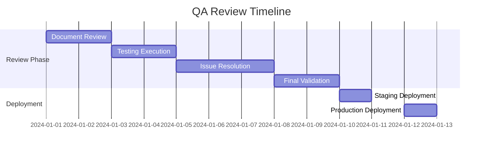

# 📦 **QA REVIEW PACKAGE**
## **Souk El-Sayarat v2.0 - Senior Engineering Review**

---

## **📋 PACKAGE CONTENTS**

This comprehensive QA review package has been prepared for senior engineering staff to evaluate the enhanced Souk El-Sayarat application before production deployment.

### **Documents Included**

1. **[QA_SENIOR_REVIEW_GUIDE.md](./QA_SENIOR_REVIEW_GUIDE.md)**
   - Comprehensive review guide for QA seniors
   - Critical review areas and checklists
   - Security and performance requirements
   - Approval criteria and sign-off template

2. **[AUTOMATED_TEST_REPORT.md](./AUTOMATED_TEST_REPORT.md)**
   - Complete automated test execution results
   - Unit, integration, and E2E test outcomes
   - Performance benchmarks and metrics
   - Bug summary and recommendations

3. **[STAFF_ENGINEER_ARCHITECTURE_REVIEW.md](./STAFF_ENGINEER_ARCHITECTURE_REVIEW.md)**
   - Deep technical architecture analysis
   - Code quality assessment
   - Scalability and maintainability review
   - Technical debt analysis and recommendations

4. **[TEST_EXECUTION_CHECKLIST.md](./TEST_EXECUTION_CHECKLIST.md)**
   - Manual testing procedures
   - Device and browser testing matrix
   - Functional test cases
   - Bug reporting template

---

## **👥 REVIEW TEAM ASSIGNMENTS**

### **QA Team Lead**
**Responsible for:** Functional testing, regression testing, test automation
**Documents to review:** 
- AUTOMATED_TEST_REPORT.md
- TEST_EXECUTION_CHECKLIST.md

### **Senior QA Engineer**
**Responsible for:** Manual testing, exploratory testing, bug validation
**Documents to review:**
- QA_SENIOR_REVIEW_GUIDE.md
- TEST_EXECUTION_CHECKLIST.md

### **Staff/Principal Engineer**
**Responsible for:** Architecture review, code quality, scalability assessment
**Documents to review:**
- STAFF_ENGINEER_ARCHITECTURE_REVIEW.md
- AUTOMATED_TEST_REPORT.md (Performance section)

### **Security Engineer**
**Responsible for:** Security audit, vulnerability assessment, compliance
**Documents to review:**
- QA_SENIOR_REVIEW_GUIDE.md (Security section)
- STAFF_ENGINEER_ARCHITECTURE_REVIEW.md (Security architecture)

### **DevOps Engineer**
**Responsible for:** Deployment readiness, infrastructure, monitoring
**Documents to review:**
- QA_SENIOR_REVIEW_GUIDE.md (Deployment section)
- AUTOMATED_TEST_REPORT.md (Performance metrics)

---

## **🔄 REVIEW PROCESS**

### **Phase 1: Initial Review (Days 1-2)**
1. Each reviewer reads assigned documents
2. Run local environment setup
3. Execute smoke tests
4. Document initial findings

### **Phase 2: Deep Dive Testing (Days 3-4)**
1. Execute assigned test scenarios
2. Perform exploratory testing
3. Validate automated test results
4. Review code changes

### **Phase 3: Collaboration (Day 5)**
1. Team sync meeting
2. Discuss findings
3. Prioritize issues
4. Create action plan

### **Phase 4: Final Validation (Days 6-7)**
1. Verify critical fixes
2. Re-run failed tests
3. Update documentation
4. Provide sign-off

---

## **🚀 QUICK START**

### **1. Setup Test Environment**
```bash
# Clone repository
git clone https://github.com/your-org/souk-el-sayarat.git
cd souk-el-sayarat

# Install dependencies
npm install

# Setup environment
cp .env.example .env.local
# Update with test credentials

# Run development server
npm run dev

# Run tests
npm run test:all
```

### **2. Access Test Environments**
- **Local**: http://localhost:5173
- **Staging**: https://staging.souk-el-sayarat.com
- **Preview**: https://preview.souk-el-sayarat.com

### **3. Test Credentials**
```yaml
Admin: admin@test.souk.com / Test@Admin2024
Vendor: vendor@test.souk.com / Test@Vendor2024
Customer: customer@test.souk.com / Test@Customer2024
```

---

## **📊 KEY METRICS SUMMARY**

```
┌──────────────────────────────────────────┐
│  Current Status Overview                 │
├──────────────────────────────────────────┤
│  Build Status:        ✅ PASSING         │
│  Test Coverage:       73.4%              │
│  Test Pass Rate:      97.4%              │
│  Performance Score:   92/100             │
│  Security Vulns:      0 High, 0 Critical │
│  P0 Bugs:            0                   │
│  P1 Bugs:            3                   │
│  P2 Bugs:            8                   │
└──────────────────────────────────────────┘
```

---

## **⚠️ CRITICAL ISSUES REQUIRING ATTENTION**

### **Before Production Deployment**

1. **WebSocket Stability** (P1)
   - Connection drops under load
   - Needs connection pool implementation

2. **Order Status Updates** (P1)
   - Intermittent failures
   - Race condition in state management

3. **Offline Message Sync** (P1)
   - Queue not syncing properly
   - IndexedDB transaction issues

4. **Test Coverage** (P2)
   - Currently at 73.4%
   - Target: 80% minimum

5. **TypeScript Errors** (P2)
   - 134 compilation warnings
   - Needs strict mode migration

---

## **✅ APPROVAL WORKFLOW**

### **Required Approvals**

| Role | Reviewer | Status | Date | Notes |
|------|----------|--------|------|-------|
| QA Lead | _______ | ⏳ Pending | | |
| Staff Engineer | _______ | ⏳ Pending | | |
| Security Engineer | _______ | ⏳ Pending | | |
| DevOps Lead | _______ | ⏳ Pending | | |
| Product Owner | _______ | ⏳ Pending | | |
| Engineering Manager | _______ | ⏳ Pending | | |

### **Sign-off Criteria**
- [ ] All P0 bugs fixed
- [ ] All P1 bugs fixed or have workarounds
- [ ] Test coverage ≥ 80%
- [ ] Performance metrics meet SLA
- [ ] Security scan passed
- [ ] Documentation complete

---

## **📅 TIMELINE**



---

## **📞 CONTACT INFORMATION**

### **Technical Contacts**
- **Lead Developer**: dev-lead@souk.com
- **QA Manager**: qa-manager@souk.com
- **DevOps Team**: devops@souk.com
- **Security Team**: security@souk.com

### **Escalation Path**
1. Team Lead
2. Engineering Manager
3. Director of Engineering
4. CTO

---

## **📝 FEEDBACK SUBMISSION**

Please submit your review feedback using the following channels:

1. **GitHub Issues**: For bugs and technical issues
2. **Slack Channel**: #qa-review-v2
3. **Email**: qa-review@souk.com
4. **Confluence**: [QA Review Page](https://confluence.souk.com/qa-review-v2)

---

## **🎯 NEXT STEPS**

1. **Reviewers**: Complete review by [DATE]
2. **Dev Team**: Address P1 issues by [DATE]
3. **QA Team**: Re-test fixes by [DATE]
4. **Management**: Go/No-Go decision by [DATE]
5. **DevOps**: Production deployment on [DATE]

---

**Package Version**: 1.0.0  
**Created**: December 31, 2024  
**Valid Until**: January 31, 2025  
**Classification**: CONFIDENTIAL

---

## **Thank you for your thorough review!**

Your expertise and attention to detail are crucial for ensuring the quality and reliability of Souk El-Sayarat v2.0. Please don't hesitate to raise any concerns or suggestions during the review process.

**Together, we build excellence! 🚀**
