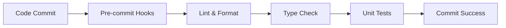
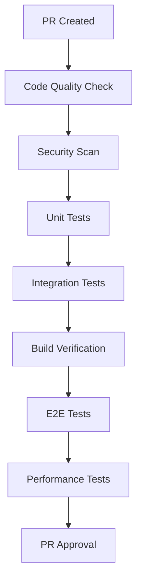
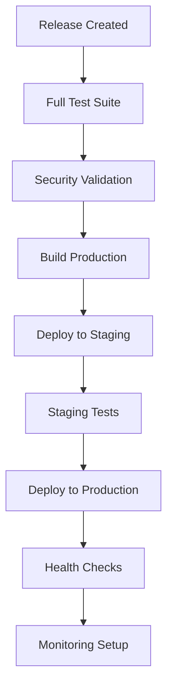

# 🤖 **AUTOMATION GUIDE**
## Professional Development & Deployment Automation for Souk El-Sayarat

### 📋 **Overview**

This guide covers the comprehensive automation system implemented for Souk El-Sayarat, including CI/CD pipelines, testing automation, monitoring, and deployment processes.

---

## 🚀 **CI/CD PIPELINE**

### **GitHub Actions Workflows**

#### 1. **Main CI/CD Pipeline** (`.github/workflows/ci-cd-pipeline.yml`)
- **Triggers:** Push to main/develop, Pull Requests, Releases
- **Features:**
  - Code quality analysis
  - Comprehensive testing (Unit, Integration, E2E)
  - Security scanning
  - Automated builds
  - Staging/Production deployments
  - Post-deployment monitoring

#### 2. **Automated Testing** (`.github/workflows/automated-testing.yml`)
- **Triggers:** Push, PR, Daily schedule
- **Features:**
  - Multi-version Node.js testing
  - Unit tests with coverage
  - Integration tests with Firebase emulators
  - E2E tests with Playwright
  - Mobile/responsive testing
  - Performance testing with Lighthouse
  - Security testing

#### 3. **Monitoring & Alerts** (`.github/workflows/monitoring-alerts.yml`)
- **Triggers:** Every 15 minutes, Manual dispatch
- **Features:**
  - Health monitoring
  - Performance metrics
  - Security headers check
  - Analytics monitoring
  - Backup status
  - Uptime monitoring
  - Slack notifications

#### 4. **Code Quality & Security** (`.github/workflows/code-quality-security.yml`)
- **Triggers:** Push, PR, Daily security scans
- **Features:**
  - ESLint analysis
  - TypeScript strict checking
  - Code complexity analysis
  - SonarCloud integration
  - Dependency security audits
  - SAST/DAST scanning
  - Secrets detection

---

## 📦 **NPM SCRIPTS**

### **Development Scripts**
```bash
# Start development server
npm run dev

# Build for production
npm run build
npm run build:production

# Preview production build
npm run preview
```

### **Code Quality Scripts**
```bash
# Linting
npm run lint              # Run ESLint
npm run lint:fix          # Fix ESLint issues
npm run lint:security     # Security-focused linting

# Formatting
npm run format            # Format code with Prettier
npm run format:check      # Check code formatting

# Type Checking
npm run type-check        # TypeScript type checking
npm run type-check:strict # Strict TypeScript checking
```

### **Testing Scripts**
```bash
# Unit Tests
npm run test              # Run all tests
npm run test:unit         # Run unit tests only
npm run test:coverage     # Run with coverage
npm run test:watch        # Watch mode

# Integration Tests
npm run test:integration  # Run integration tests

# E2E Tests
npm run test:e2e          # Run Playwright E2E tests
npm run test:mobile       # Run mobile tests

# Coverage & Reporting
npm run coverage:report   # Generate coverage reports
npm run coverage:badges   # Generate coverage badges
npm run test:threshold    # Check coverage thresholds
```

### **Security Scripts**
```bash
npm run security:audit    # NPM security audit
npm run security:check    # Comprehensive security check
npm run security:fix      # Fix security issues
```

### **Performance Scripts**
```bash
npm run analyze           # Bundle analysis
npm run bundle:size-limit # Check bundle size limits
npm run performance:lighthouse # Lighthouse audit
```

### **Deployment Scripts**
```bash
# Firebase Deployment
npm run firebase:deploy           # Full deployment
npm run firebase:hosting:deploy   # Hosting only
npm run firebase:functions:deploy # Functions only
npm run firebase:rules:deploy     # Rules only

# Environment Deployments
npm run deploy:staging     # Deploy to staging
npm run deploy:production  # Deploy to production
npm run deploy:preview     # Deploy preview channel
```

### **Utility Scripts**
```bash
# Cleanup
npm run clean             # Clean build artifacts
npm run clean:all         # Clean everything including node_modules
npm run clean:cache       # Clean cache

# CI/CD
npm run ci                # Basic CI checks
npm run ci:full           # Full CI pipeline
npm run precommit         # Pre-commit checks
npm run validate          # Full validation

# Documentation
npm run docs:generate     # Generate API docs
npm run docs:serve        # Serve documentation
```

---

## 🔧 **CONFIGURATION FILES**

### **Code Quality**
- `.eslintrc.cjs` - Main ESLint configuration
- `.eslintrc-security.js` - Security-focused ESLint rules
- `.prettierrc.json` - Prettier formatting rules
- `tsconfig.json` - TypeScript configuration

### **Testing**
- `vitest.config.ts` - Vitest configuration
- `playwright.config.ts` - Playwright E2E testing
- `src/test/setup.ts` - Test environment setup

### **Performance & Monitoring**
- `.lighthouserc.json` - Lighthouse CI configuration
- `size-limit.config.js` - Bundle size limits

### **Security**
- `.secrets.baseline` - Secrets detection baseline
- `.zap/rules.tsv` - OWASP ZAP security rules

---

## 🔄 **AUTOMATION WORKFLOWS**

### **1. Code Commit Workflow**


### **2. Pull Request Workflow**


### **3. Deployment Workflow**


---

## 📊 **MONITORING & ALERTING**

### **Health Monitoring**
- **Frequency:** Every 15 minutes
- **Metrics:** Response time, HTTP status, uptime
- **Alerts:** Slack notifications for failures

### **Performance Monitoring**
- **Metrics:** Page load speed, Lighthouse scores
- **Thresholds:** Response time < 2s, Lighthouse > 80
- **Reports:** Daily performance summaries

### **Security Monitoring**
- **Checks:** Security headers, vulnerability scans
- **Frequency:** Daily security scans
- **Alerts:** Immediate alerts for security issues

### **Analytics Monitoring**
- **Metrics:** User activity, conversion rates
- **Reports:** Daily analytics summaries
- **Integration:** Firebase Analytics

---

## 🔒 **SECURITY AUTOMATION**

### **Static Analysis Security Testing (SAST)**
- **Tools:** ESLint Security, SonarCloud, Semgrep
- **Coverage:** Code vulnerabilities, security patterns
- **Integration:** GitHub Actions, PR checks

### **Dynamic Analysis Security Testing (DAST)**
- **Tools:** OWASP ZAP, Nuclei
- **Coverage:** Runtime vulnerabilities, web security
- **Environment:** Automated against staging

### **Dependency Security**
- **Tools:** NPM Audit, Snyk, OWASP Dependency Check
- **Coverage:** Third-party vulnerabilities
- **Automation:** Daily scans, PR checks

### **Secrets Detection**
- **Tools:** TruffleHog, GitLeaks, detect-secrets
- **Coverage:** API keys, passwords, tokens
- **Prevention:** Pre-commit hooks, CI/CD checks

---

## 📈 **PERFORMANCE OPTIMIZATION**

### **Bundle Analysis**
- **Tool:** Vite Bundle Analyzer
- **Monitoring:** Bundle size limits with size-limit
- **Optimization:** Code splitting, tree shaking

### **Lighthouse Audits**
- **Frequency:** Every deployment
- **Metrics:** Performance, Accessibility, SEO, PWA
- **Thresholds:** Performance > 80, Accessibility > 90

### **Performance Budgets**
- **Main Bundle:** < 500KB (gzipped)
- **CSS Bundle:** < 100KB (gzipped)
- **Total Bundle:** < 1.5MB (gzipped)

---

## 🚀 **DEPLOYMENT AUTOMATION**

### **Environment Strategy**
- **Development:** Local development with emulators
- **Staging:** Automated deployment on develop branch
- **Production:** Manual deployment on release

### **Deployment Process**
1. **Pre-deployment Checks**
   - Code quality validation
   - Security scanning
   - Test suite execution
   - Build verification

2. **Deployment Execution**
   - Firebase hosting deployment
   - Functions deployment
   - Rules deployment
   - CDN cache invalidation

3. **Post-deployment Verification**
   - Health checks
   - Performance validation
   - Monitoring setup
   - Notification dispatch

---

## 🛠️ **TROUBLESHOOTING**

### **Common Issues**

#### **Build Failures**
```bash
# Check build logs
npm run build

# Clean and rebuild
npm run clean
npm ci
npm run build
```

#### **Test Failures**
```bash
# Run specific test suite
npm run test:unit
npm run test:integration

# Debug with UI
npm run test:ui
```

#### **Deployment Issues**
```bash
# Check Firebase status
firebase projects:list
firebase login

# Verify build
npm run build
npm run preview
```

### **Monitoring Issues**
- Check Slack notifications in `#alerts` channel
- Review GitHub Actions workflow logs
- Monitor Firebase console for errors
- Check Lighthouse reports for performance issues

---

## 📚 **BEST PRACTICES**

### **Development**
1. **Always run pre-commit checks:** `npm run precommit`
2. **Write tests for new features:** Maintain 80%+ coverage
3. **Follow security guidelines:** Use security linting
4. **Monitor performance:** Check bundle size regularly

### **Testing**
1. **Unit tests:** Test individual components/functions
2. **Integration tests:** Test service interactions
3. **E2E tests:** Test complete user workflows
4. **Performance tests:** Validate speed and responsiveness

### **Deployment**
1. **Test in staging first:** Always validate before production
2. **Monitor after deployment:** Check health and performance
3. **Have rollback plan:** Be prepared to revert if needed
4. **Document changes:** Update changelog and documentation

### **Security**
1. **Regular scans:** Daily security checks
2. **Dependency updates:** Keep packages updated
3. **Secret management:** Never commit secrets
4. **Access control:** Limit production access

---

## 🎯 **NEXT STEPS**

1. **Set up GitHub repository secrets:**
   - `FIREBASE_PROJECT_ID`
   - `FIREBASE_TOKEN`
   - `SLACK_WEBHOOK`
   - `SONAR_TOKEN`
   - `SNYK_TOKEN`

2. **Configure Firebase projects:**
   - Production environment
   - Staging environment
   - Security rules

3. **Set up monitoring:**
   - Slack workspace
   - Alert channels
   - Dashboard access

4. **Team onboarding:**
   - Development workflow
   - Testing procedures
   - Deployment process

---

**🤖 Your automation system is ready for professional development and deployment!**
